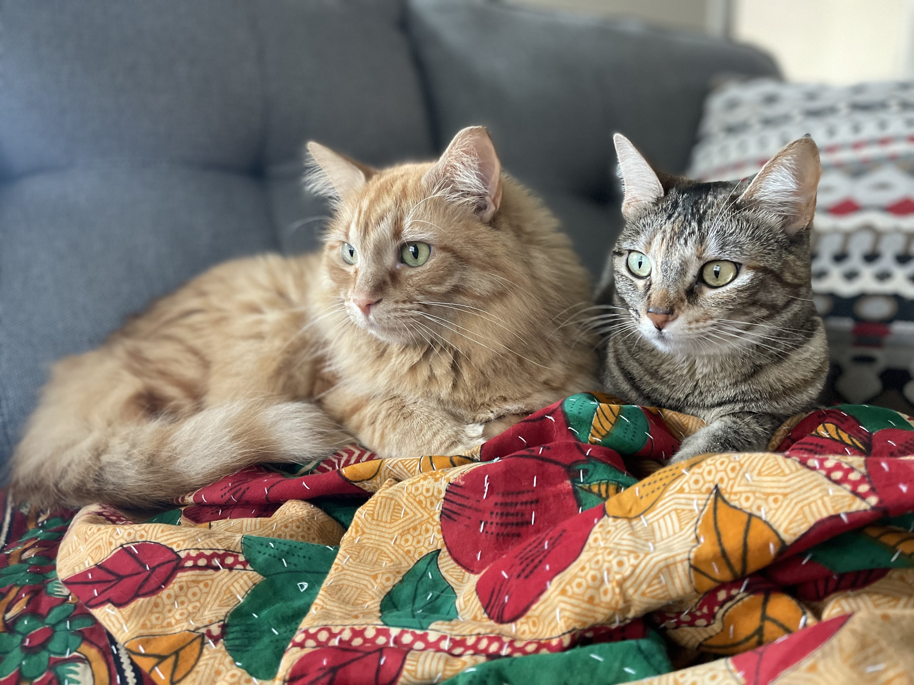

```{r}
#| echo: false
library(ggplot2)
library(dplyr)
library(sf)
library(rnaturalearth)
library(showtext)
library(ggforce)
library(stringr)
```

## Welcome to STATS 100

- Introduction to People
- Introduction to the Course
- Introduction to the Toolkit

# Introduction to People {.inverse background-color="#A51C30"}

## Hello 👋

Mine Dogucu

pronounciation: Mi-neh Doe-uu-joo

Senior Lecturer on Statistics

. . .

I joined Harvard in July.

## My First Home


```{r}
#| fig-alt: World Map with title that reads Mersin, Turkiye and location south of Turkey on the Mediterranean cost is highlighted
#| fig-align: center
#| echo: false
# ------------------------------------------------------------------------------
# 1. Typography & Theme Constants
# ------------------------------------------------------------------------------
font_add_google(name = "Atkinson Hyperlegible", family = "atkinson")
showtext_auto()

color_crimson    <- "#A51C30" # $harvard-crimson
color_bg         <- "#F9F9FB" # $body-bg
color_text_main  <- "#1E1E1E" # $body-color
color_text_muted <- "#2D2D2D" # $text-muted
color_land       <- "#E2E8F0" # Mild gray for landmasses
color_ocean      <- "#FFFFFF" # Clean white ocean background

# ------------------------------------------------------------------------------
# 2. Data Preparation
# ------------------------------------------------------------------------------
world_sf <- ne_countries(scale = "small", returnclass = "sf")

mersin_sf <- tibble(
  name = "Mersin, Türkiye",
  lon  = 34.6415,
  lat  = 36.8121
) %>% 
  st_as_sf(coords = c("lon", "lat"), crs = 4326)

# ------------------------------------------------------------------------------
# 3. World Map Visualization
# ------------------------------------------------------------------------------
mersin_world_map <- ggplot() +
  # World Landmasses
  geom_sf(
    data = world_sf,
    fill = color_land,
    color = "#FFFFFF",
    linewidth = 0.15
  ) +
  # Map Pin: Subtle background pulse ring + precise pinpoint
  geom_sf(
    data = mersin_sf,
    color = color_crimson,
    alpha = 0.35,
    size = 4.5
  ) +
  geom_sf(
    data = mersin_sf,
    color = color_crimson,
    shape = 21,
    fill = "#FFFFFF",
    stroke = 1.5,
    size = 2.2
  ) +
  # Robinson Projection
  coord_sf(crs = "+proj=robin") +
  # Header Titles
  labs(
    title = "Mersin, Türkiye"
  ) +
  # Clean Presentation Theme
  theme_minimal(base_family = "atkinson") +
  theme(
    plot.background  = element_rect(fill = color_bg, color = NA),
    panel.background = element_rect(fill = color_ocean, color = NA),
    panel.grid.major = element_line(color = "#F1F1F4", linewidth = 0.2),
    plot.title = element_text(
      size = 18,
      face = "bold",
      color = color_crimson,
      margin = margin(b = 4)
    ),
    plot.subtitle = element_text(
      size = 11,
      color = color_text_muted,
      margin = margin(b = 10)
    ),
    axis.title  = element_blank(),
    axis.text   = element_blank(),
    axis.ticks  = element_blank(),
    plot.margin = margin(t = 15, r = 15, b = 15, l = 15)
  )

mersin_world_map

```

. . .

Fun fact: My native language (Turkish) does not have gendered pronouns. In English, I use she/they as my pronouns.

## Most Recent Home

```{r}
#| fig-alt: World Map with title that reads Los Angeles, California and location on the West Coast of the United States on the Pacific coast is highlighted
#| fig-align: center
#| echo: false

world_sf <- ne_countries(scale = "small", returnclass = "sf")

la_sf <- tibble(
  name = "Los Angeles, California",
  lon  = -118.2437,
  lat  = 34.0522
) %>% 
  st_as_sf(coords = c("lon", "lat"), crs = 4326)


la_world_map <- ggplot() +
  # World Landmasses
  geom_sf(
    data = world_sf,
    fill = color_land,
    color = "#FFFFFF",
    linewidth = 0.15
  ) +
  # Map Pin: Subtle background pulse ring + precise pinpoint
  geom_sf(
    data = la_sf,
    color = color_crimson,
    alpha = 0.35,
    size = 4.5
  ) +
  geom_sf(
    data = la_sf,
    color = color_crimson,
    shape = 21,
    fill = "#FFFFFF",
    stroke = 1.5,
    size = 2.2
  ) +
  # Robinson Projection
  coord_sf(crs = "+proj=robin") +
  # Header Titles
  labs(
    title = "Los Angeles, California"
  ) +
  # Clean Presentation Theme
  theme_minimal(base_family = "atkinson") +
  theme(
    plot.background  = element_rect(fill = color_bg, color = NA),
    panel.background = element_rect(fill = color_ocean, color = NA),
    panel.grid.major = element_line(color = "#F1F1F4", linewidth = 0.2),
    plot.title = element_text(
      size = 18,
      face = "bold",
      color = color_crimson,
      margin = margin(b = 4)
    ),
    plot.subtitle = element_text(
      size = 11,
      color = color_text_muted,
      margin = margin(b = 10)
    ),
    axis.title  = element_blank(),
    axis.text   = element_blank(),
    axis.ticks  = element_blank(),
    plot.margin = margin(t = 15, r = 15, b = 15, l = 15)
  )

la_world_map
```

I was Associate Professor of Teaching in the Department of Statistics at University of California Irvine.


## Fun facts about me


::: columns
::: {.column width="40%"}

```{r}
#| fig-alt: An orange cat and a tabby cat laying down and looking in the same direction.
#| echo: false

```

:::

::: {.column width="60%"}
::: incremental

- I have two cats: Mohsen (left) and Mojdeh (right).
- I lived in the 20th century.
- I love languages (and linguistics), movies, and books.
- Not so fun fact: I was a first generation, low income college student. 

:::
:::
:::

## Meet the Teaching Team


THANKFULLY, I am NOT teaching this class by myself. 

[Meet the Teaching Team](https://stat-100.com/people.html) on the course website. 

## Meet Your Peers

::: {.stat-callout .discussion}
**Discussion**
In groups of three or four meet and greet each other.
You may consider sharing some or all of the following:  
- Your name  
- Your pronouns  
- Your year  
- Where you live   
- What excites you about this semester  
:::

## Meet Your Peers - Location


## Help from the Teaching Team

- We are here to help you throughout the semester on your BEST days and WORST days when it comes to STAT 100.
- Make sure to use the calendar feature on the [Home page](https://stat-100.com/) to find office hours. 

## Concerns - Math

<center>

<iframe width="560" height="315" src="https://www.youtube.com/embed/uwCH-G83wvc?start=0&end=75" title="YouTube video player" frameborder="0" allow="accelerometer; autoplay; clipboard-write; encrypted-media; gyroscope; picture-in-picture; web-share" referrerpolicy="strict-origin-when-cross-origin" allowfullscreen> </iframe>

</center>

. . .

Some good news: 

Statistics is not math but it does use math - like physics.   
We do not have problem sets - we have homework assignments. 😊

## Other Concerns

- No programming background - that's ok programming is not a prerequisite

. . .

- Time management - [ARC has great tips](https://academicresourcecenter.harvard.edu/2023/09/27/time-management/) and accountability hours.

. . .

- I might need help - Great, we are here to help you! [Office Hours](https://stat-100.com/policies.html#office-hours).


# Introduction to the Course {.inverse background-color="#A51C30"}


## Learning Effort

```{r}
#| echo: false
#| fig-alt: "Four rectangles on a spectrum going from low effort on the left to excessive effort/overload on the right. The rectangles read 'Zone 1: Illusion of Competence', 'Zone 2: Shallow Learning', 'Zone 3: Desirable Difficulty, high effort, delayed gratification, durable knowledge' and 'Zone 4: Frustration and Overload' "
#| fig-align: center

# Define zone labels and wrap text automatically
zone_titles <- c(
  "Zone 1: Illusion of Competence",
  "Zone 2: Shallow Learning",
  "Zone 3: Desirable Difficulty",
  "Zone 4: Frustration and Overload"
)

# Apply str_wrap to title text (wraps after ~15 characters)
wrapped_titles <- str_wrap(zone_titles, width = 15)

# Wrap Zone 3 attributes text
z3_details <- str_wrap("• High Effort\n• Delayed Gratification\n• Durable Knowledge", width = 20)

# Define data frame
zones <- data.frame(
  xmin = c(0, 25, 50, 80),
  xmax = c(25, 50, 80, 100),
  ymin = 1,
  ymax = 4,
  title = wrapped_titles,
  # Harvard Crimson (#A51C30) exclusively for Zone 3 highlight
  fill_color = c("#F8F9FA", "#F8F9FA", "#A51C30", "#F8F9FA"), 
  text_color = c("#1E1E1E", "#1E1E1E", "#FFFFFF", "#1E1E1E"),
  border_color = c("#CBD5E1", "#CBD5E1", "#1E1E1E", "#CBD5E1"),
  border_size = c(0.5, 0.5, 1.5, 0.5)
)

# Render plot
p <- ggplot(zones) +
  # Spectrum zone blocks
  geom_rect(
    aes(xmin = xmin, xmax = xmax, ymin = ymin, ymax = ymax, 
        fill = fill_color, color = border_color, size = border_size),
    show.legend = FALSE
  ) +
  scale_fill_identity() +
  scale_color_identity() +
  scale_size_identity() +
  
  # Zone titles (Auto-wrapped)
  geom_text(
    aes(x = (xmin + xmax) / 2, y = 3.1, label = title, color = text_color),
    fontface = "bold", size = 4.2, lineheight = 0.9, show.legend = FALSE
  ) +
  
  # Wrapped key attributes in Zone 3
  annotate(
    "text", x = 65, y = 1.8, 
    label = z3_details,
    color = "#FFFFFF", fontface = "bold", size = 3.8, lineheight = 1.1
  ) +
  
  # Bottom axis line
  geom_segment(
    aes(x = 0, xend = 100, y = 0.3, yend = 0.3),
    arrow = arrow(length = unit(0.35, "cm"), type = "closed"),
    color = "#1E1E1E", size = 1.1
  ) +
  
  # Axis endpoint labels
  annotate("text", x = 0, y = -0.15, label = "Low Effort", fontface = "bold", size = 4, hjust = 0, color = "#1E1E1E") +
  annotate("text", x = 100, y = -0.15, label = "Excessive Effort / Overload", fontface = "bold", size = 4, hjust = 1, color = "#1E1E1E") +
  
  # Canvas settings
  coord_cartesian(xlim = c(-2, 102), ylim = c(-0.5, 4.5)) +
  theme_void() +
  theme(plot.margin = margin(20, 20, 20, 20))

print(p)
```


[Making Things Hard on Yourself, But in a Good Way:
Creating Desirable Difficulties to Enhance Learning](https://bjorklab.psych.ucla.edu/wp-content/uploads/sites/13/2016/04/EBjork_RBjork_2011.pdf)

## A brief history lesson

People have been playing chance games for a long time. 
These tools from Ice Age from 12,800-12,200 years ago are said to be dice used by Native Americans of the Great Plains region. 


```{r}
#| fig-alt: two sided bone structures in varying sizes and shapes with some carvings on some sides. two sides are visible.
#| fig-align: center
#| echo: false

```
[Image from Colorado State University, College of Liberal Arts](https://libarts.source.colostate.edu/how-native-americans-shaped-gambling-and-probability/)

. . . 

People gambled but they did not yet ask "What are the odds?"


## Then came probability theory

```{r}
#| echo: false
nodes <- data.frame(
  x = c(2, 8),
  y = c(5, 5),
  r_x = c(1.8, 1.8),
  r_y = c(1.1, 1.1)
)

# Base theme
theme_slide_diagram <- function() {
  theme_void() +
    theme(
      plot.background = element_rect(fill = color_bg, color = NA),
      panel.background = element_rect(fill = color_bg, color = NA)
    )
}

# ==========================================
# DIAGRAM 1: PROBABILITY
# ==========================================
plot_probability <- ggplot() +
  # Draw nodes
  geom_ellipse(data = nodes, aes(x0 = x, y0 = y, a = r_x, b = r_y, angle = 0),
               color = color_crimson, fill = "white", linewidth = 1.5) +
  
  # Curved arrow (Top)
  geom_curve(aes(x = 3.6, y = 5.5, xend = 6.4, yend = 5.5),
             curvature = -0.35, arrow = arrow(length = unit(0.35, "cm"), type = "closed"),
             color = color_text_main, linewidth = 1.0) +
  
  # Text labels
  annotate("text", x = 5, y = 6.6, label = "Probability", 
           color = color_text_main, size = 7, fontface = "bold") +
  annotate("text", x = 2, y = 5.35, label = "Design of the Coin", 
           color = color_text_main, size = 6, fontface = "bold") +
  annotate("text", x = 2, y = 4.55, label = expression(pi == 0.5), 
           color = color_text_muted, size = 5.5, fontface = "bold") +
  annotate("text", x = 8, y = 5.35, label = "Observed Data", 
           color = color_text_main, size = 6, fontface = "bold") +
  annotate("text", x = 8, y = 4.55, label = "?", 
           color = color_text_muted, size = 5.5, fontface = "bold") +
  
  coord_fixed(xlim = c(0, 10), ylim = c(2, 8)) +
  theme_slide_diagram()

# ==========================================
# DIAGRAM 2: STATISTICAL INFERENCE
# ==========================================
plot_inference <- ggplot() +
  # Draw nodes
  geom_ellipse(data = nodes, aes(x0 = x, y0 = y, a = r_x, b = r_y, angle = 0),
               color = color_crimson, fill = "white", linewidth = 1.5) +
  
  # Curved arrow (Bottom)
  geom_curve(aes(x = 6.4, y = 4.5, xend = 3.6, yend = 4.5),
             curvature = -0.35, arrow = arrow(length = unit(0.35, "cm"), type = "closed"),
             color = color_text_main, linewidth = 1.0) +
  
  # Text labels
  annotate("text", x = 5, y = 3.3, label = "Statistical Inference", 
           color = color_text_main, size = 7, fontface = "bold") +
  annotate("text", x = 2, y = 5.35, label = "Design of the Coin", 
           color = color_text_main, size = 6, fontface = "bold") +
  annotate("text", x = 2, y = 4.55, label = expression(pi == "?"), 
           color = color_text_muted, size = 5.5, fontface = "bold") +
  annotate("text", x = 8, y = 5.35, label = "Observed Data", 
           color = color_text_main, size = 6, fontface = "bold") +
  annotate("text", x = 8, y = 4.55, label = "H, H, H, H, T", 
           color = color_text_muted, size = 5.5, fontface = "bold") +
  
  coord_fixed(xlim = c(0, 10), ylim = c(2, 8)) +
  theme_slide_diagram()
```


```{r}
#| fig-align: center
#| fig-alt: 'Diagram showing two equal-sized oval nodes connected by a curved arrow on top pointing left-to-right labeled "Probability". The left oval is titled "Design of the Coin" with a known probability pi equals 0.5. The right oval is titled "Observed Data" containing a question mark, illustrating how probability moves from a known coin model to predicting outcome.'
#| echo: false
plot_probability
```

A fair coin is designed to land on heads half the time. 

If I flip a coin 5 times what is the probability of getting 2 heads? 

## Then came statistical inference

```{r}
#| fig-align: center
#| fig-alt: 'Diagram showing two equal-sized oval nodes connected by a curved arrow on the bottom pointing right-to-left labeled "Statistical Inference". The right oval is titled "Observed Data" containing five coin toss results: H, H, H, H, T. The left oval is titled "Design of the Coin" with an unknown probability pi equals question mark, illustrating how statistical inference works backward from observed data to infer the underlying coin design.'
#| echo: false
plot_inference
```

In many instances, we do not design of the coin and we are wondering if it is a fair coin. 
For instance if we observe H, H, H, H, T on five coin flips, what is the likelihood that this is a fair coin?

## More questions

These days statisticians and scientists who use statistics ask more interesting questions than just gambling!

[How do companies benefit when employees work remotely?](https://www.library.hbs.edu/working-knowledge/how-companies-benefit-when-employees-work-remotely)

[Can social isolation, loneliness shorten life?](https://news.harvard.edu/gazette/story/2023/10/how-social-isolation-loneliness-can-shorten-your-life/)

[Who wrote the Beatles song "In My Life?" John Lennon or Paul McCartney?](https://news.harvard.edu/gazette/story/2018/09/harvard-statistician-examines-beatles-mystery/)


## Then came data science

Modern times brought 

- big data, high dimensional data (dataset with lots of information)
- different types of data (e.g., text and images at larger scale and precision)
- a lot of user data
- computational advances
- complex algorithms

## Even more questions

[How does Netflix predict which thumbnail image will make you click a movie?](https://blogs.cornell.edu/info2040/2022/09/28/how-netflix-uses-matching-to-pick-the-best-thumbnail-for-you/)

. . .


## The 4 Workflow Phases We'll Learn

:::: {.columns}

::: {.column width="25%"}
1. Preparation
- Defining the problem
- Formulating research questions
- Data acquisition
- Data cleaning 
:::

::: {.column width="25%"}
2. Analysis
- Descriptive statistics
- Data Visualization
- Statistical Modeling
:::

::: {.column width="25%"}
3. Interpretation
- Model evaluation
- Inference
:::

::: {.column width="25%"}
4. Dissemination
- Communicating findings
- Writing reports online
- Writing papers
:::

::::

## Example Study

::: {.stat-callout .discussion}
Read the abstract of the following study and decide with your neighbors what kind of data had to be collected about students to make the claims that the researchers are making.
:::

[ Stromberg, David and Lei, Victor and Wu, Yanhui, The Generative AI Learning Penalty: Evidence from Chinese Secondary Education (June 02, 2026). Available at SSRN: https://ssrn.com/abstract=6868618 or http://dx.doi.org/10.2139/ssrn.6868618](https://papers.ssrn.com/sol3/papers.cfm?abstract_id=6868618)

## Some types of questions that can be answered using statistics

**Descriptive**  

**Comparative** 

**Relational** 

**Predictive** 

## Some findings from the manuscript - Descriptive

> ...at the time of our survey (June 2025), around 80 percent of the
students report using generative AI. The most popular tools were Doubao, DeepSeek,
ChatGLM, Ernie Bot, and Qwen. Generative AI was reported to be most frequently
used in mathematics (66 percent) and English (55 percent), while between 30 and 40
percent of the students report AI use in other subjects.

## Some findings from the manuscript - Comparative


Students who used generative AI for homework completed assignments 30% faster.

## Some findings from the manuscript - Relational


>For AI-using students, the pattern is quite different. More than half of AI students
spend 20-50 minutes completing homework, less time than even the fastest non-AI
students. This group receives very high homework scores. Their median score is
consistent with the performance of generative AI tools on similar problems (Hou et al.,
2024). At the same time, they receive extremely low exam scores. This pattern- low
time on task, high homework scores, and low exam scores- is entirely consistent with
homework outsourcing.

## Some findings from the manuscript - Predictive

> In traditional educational settings, homework performance
reliably predicts exam performance, reflecting the practice and consolidation effects of
completing learning tasks. Figure A11 illustrates this relationship for non-AI students.


## Mini Syllabus

- AI policy
- No-tech policy (except for quiz time)
- In class quizzes
- Homework assignments
- Section activities
- Exams
- Project


## Slides - how to pdf

::: {.stat-callout .note-tip}

If you would like to print or save pdf version of the slides then press M in your web browser Click `Tools > PDF Export Mode`.
:::

# Introduction to the Toolkit {.inverse background-color="#A51C30"}


## hello woRld


I will demo live in class but [a video](https://harvard.hosted.panopto.com/Panopto/Pages/Viewer.aspx?id=a253d36c-4dab-4796-a864-b4b50140bb85) is provided to you to review after class.
Our lecture hall does not have recording software. 😭

## Code from demo


```{r}
#| error: true
print("hello woRld")
my_apples <- 4
my_apples
my_apples - 1
My_apples
n_apples <- c(7, my_apples, 13)
my_apples
my_apples <- my_apples - 1
n_apples

```

## Code from demo 

```{r}
names <- c("Menglin", "Gloria", "Robert")
data.frame(friends = names, apples = n_apples)
people <- data.frame(friends = names, apples = n_apples)
people[2, 1]
people[3, ]
people[ , 2]
```


## Object assignment operator

```{r}
my_apples <- 4
```


. . .

Keyboard Shortcut

Windows:  Alt + -

Mac: Option + - 


## R is case-sensitive


```{r}
#| error: true
My_apples
```

## Characters

If something comes in quotes, it is not defined in R. Later in the quarter we will call these as characters. More on that later.


```{r}

n_apples <- c(7, my_apples, 3)

names <- c("Menglin", "Gloria", "Robert")

data.frame(person = names, apple_count = n_apples)
```


## Vocabulary

```{r eval=FALSE}
do(something)
```

`do()` is a function;   
`something` is the argument of the function.

. . .

```{r eval=FALSE}
do(something, colorful)
```

`do()` is a function;   
`something` is the first argument of the function;   
`colorful` is the second argument of the function.


## Getting Help

In order to get any help we can use `?` followed by function (or object) name. 

```{r eval=FALSE}
?c
```

## Do not copy paste

::: {.stat-callout .note-tip}

You should not copy paste code from my slides or from the internet. 
Part of learning to code is building up your muscle memory. 
:::

## tidyverse style guide

>canyoureadthissentence?

## tidyverse style guide

:::: {.columns}

::: {.column width="40%"}
```{r eval = FALSE}
n_apples <- c(7, my_apples, 3)

names <- c("Menglin", "Gloria", "Robert")

data.frame(
  person = names, 
  apple_count = n_apples
  )
```
:::

::: {.column width="60%"}
- After function names do not leave any spaces.

- Before and after operators (e.g. <-, =) leave spaces. 

- Put a space after a comma, **not** before. 

- Object names are all lower case, with words separated by an underscore.

:::

::::

## Indentation

::: {.stat-callout .note-tip}

You can let RStudio do the indentation for your code.

:::
    
## Literate Programming - Quarto

I will demo live in class but [a video](https://harvard.hosted.panopto.com/Panopto/Pages/Viewer.aspx?id=8251c25b-c42b-4ea4-babc-b4b50140bbc2) is provided to you to review after class.

The file I create in the video similar to the [my-first-report.qmd](my-first-report.qmd) file provided here.

## markdown `r fontawesome::fa(name = "markdown")`

markdown is a markup language. Markup languages instruct software on how to display or interpret text and data. We use markdown within a Quarto document.

:::: {.columns}

::: {.column width="40%"}

```

_Hello world_ 

__Hello world__

~~Hello world~~ 
```
:::

::: {.column width="60%"}
_Hello world_ 

__Hello world__

~~Hello world~~ 
:::

::::

[markdown cheatsheet](https://www.markdownguide.org/cheat-sheet/)

## Quarto parts


```{r}
#| echo: false
#| fig-align: center
#| fig-alt: 'A screenshot of the RStudio IDE displaying a Quarto document. The screen is divided into multiple panes. The left pane shows the Quarto source code, which includes YAML metadata (title, author, format: html), a text paragraph, and an R code chunk (`my_apples <- 2`). The bottom-left pane shows the R console and "Background Jobs" tab. The right pane displays the rendered output of the Quarto document, showing "My First Quarto File", the author, the descriptive text, and the result "my_apples <- 2" leading to "I have 2 apples in total". Pink labels and arrows highlight key RStudio features: top toolbar buttons for "Save", "Render", "Options", and "Insert a code chunk"; buttons next to a code chunk for "Run code chunk" and "Run all chunks above"; and the "Background Jobs" tab in the console.'

knitr::include_graphics("images/lec01b-quarto-example-full.png")
```

Quarto source file can be accessed here [my-first-report.qmd](my-first-report.qmd).


## Slides for this course

Slides that you are currently looking at are also written in Quarto. 
You can take a look at them on our course's [GitHub organization](https://github.com/stat100-fa26) in the slides repo.

## Phone apps vs. R packages

:::: {.columns}

::: {.column width="50%"}
When you buy a new phone it comes with some apps pre-installed.

- Calendar
- Email
- Messages
:::

::: {.column width="50%"}
If you want to use a different app you can install it.

- Instagram
- GMail
- BlueSky
:::

::::

When you download R for the first time to your computer. It comes with some packages already installed. You can also install many other R packages.

## R packages

What do R packages have? All sorts of things but mainly

- functions 

- datasets

## R packages

Try running the following code:

```{r error = TRUE}
beep()
```

Why are we seeing this error? 


## Installing packages

In your **Console**, install the beepr package

```{r eval = FALSE}
install.packages("beepr")
```

We do this in the Console because we only need to do it once. If we add this code in Quarto, we will be installing the package again and again each time we render the document.


## Using beep() from beepr


Option 1
```{r warning = FALSE, eval = FALSE}
library(beepr)
beep()
```

More common usage. 

Useful if you are going to use multiple functions from the same package.
E.g. we have used many functions (ggplot, aes, geom_...) from the ggplot2 package. In such cases, usual practice is to put the library name in the first R chunk in the .qmd file.


## Using beep() from beepr

Option 2

```{r eval = FALSE}
beepr::beep()
```
Useful when you are going to use a function once or few times. Also useful if there are any conflicts. For instance if there is some other package in your environment that has a beep() function that prints the word beep, you would want to distinguish the beep function from the beepr package and the beep function from the other imaginary package. 

## Reading the documentation 

```{r}
#| eval: false
?beep
```

Running `?beep` in the Console opens the Help pane with the package documentation. We run this in the Console and not in Quarto so that we won't get the help every time we render the Quarto document.

. . .

beep {beepr} - indicates that the beep package is in the beepr package

. . .

Pay attention to parts of documentation: Description, Usage, Arguments, Details, Examples. At your stage Examples are a great resource.

. . .

## Reading the documentation 


`beep(sound = 1, expr = NULL)` indicates that the default sound is set to be 1. 

. . .

Pay attention to argument options.

## Usage example

```{r}
beepr::beep(sound = 8)
```

This should play the mariokart sound.


## Open Source

- Any one around the world can create R packages. 


- Good part: We are able to do pretty much anything R because someone from around the world has developed the package and shared it. 


- Bad part: The language can be inconsistent. 


- Good news: We have tidyverse. 


## Tidyverse


>The tidyverse is an opinionated collection of R packages designed for data science. All packages share an underlying design philosophy, grammar, and data structures. 
                  tidyverse.org


## Tidyverse

In short, tidyverse is a family of packages. From practical stand point, you can install many tidyverse packages at once (and you did this). 


## Load tidyverse packages

We can also load multiple tidyverse packages all at the same time.

```{r message = TRUE}
library(tidyverse)
```

## Bad version control

::: {.incremental}

Does this look familiar?

- hw1

- hw1_final

- hw1_final2

- hw1_final3

- hw1_finalwithfinalimages

- hw1_finalestfinal

:::


## Good version control


What if we tracked our file with better names for each version and have only 1 file **hw1**?

::: {.incremental}

- hw1 ***added questions 1 through 5***

- hw1 ***changed question 1 image***

- hw1 ***fixed typos***

:::

. . .

We will call the descriptions in italic **commit** messages.


## git vs. GitHub

- git allows us to keep track of different versions of a file(s).

- GitHub is a website where we can store (and share) different versions of the files. 

## GitHub repo

```{r}
#| out.width: '40%'
#| fig-align: 'center' 
#| echo: false
#| fig-alt: 'An orange box labeled "GitHub repo" next to a black document icon.'
knitr::include_graphics('images/lec01b-github-illustration.002.jpeg')
```

## Cloning a repo

```{r}
#| out.width: '55%'
#| fig-align: 'center'
#| echo: false
#| fig-alt: 'Diagram showing a GitHub repo with a document icon at the top, connected by a downward arrow labeled "Clone a repo" to a local repo with a document icon at the bottom.'

knitr::include_graphics('images/lec01b-github-illustration.003.jpeg')
```

## Commiting a change 1

```{r}
#| out.width: '55%'
#| fig-align: 'center'
#| echo: false
#| fig-alt: 'A diagram with "GitHub repo" and a black document icon at the top. Below it, "Local repo" is shown with a blue document icon, implying a change  has been made locally. Text below reads "Commit: changed font color to blue".'

knitr::include_graphics('images/lec01b-github-illustration.004.jpeg')
```

## Commiting a change 2

```{r}
#| out.width: '55%'
#| fig-align: 'center'
#| echo: false
#| fig-alt: 'A diagram showing a "GitHub repo" with a black document icon at the top. Below it, a "Local repo" is shown with a blue document icon, indicating a change. Text below the local repo says, "Commit: changed font size to 24".'

knitr::include_graphics('images/lec01b-github-illustration.005.jpeg')
```

## Commiting a change 3

```{r}
#| out.width: '55%'
#| fig-align: 'center'
#| echo: false
#| fig-alt: 'A diagram depicting a "GitHub repo" with a black document icon at the top. Below it, a "Local repo" is shown with a sequence of three document icons representing commits: a gray icon, followed by a light blue icon with an arrow pointing to "changed font color to blue", and finally a larger, bright blue icon with an arrow pointing to "changed font size to 24".'

knitr::include_graphics('images/lec01b-github-illustration.006.jpeg')
```

## Push

```{r}
#| out.width: '55%'
#| fig-align: 'center'
#| echo: false
#| fig-alt: 'A diagram illustrating the "Push" action in Git. A "Local repo" at the bottom shows a sequence of three commits represented by document icons: a gray one, a light blue one with text "changed font color to blue", and a bright blue one with text "changed font size to 24". An upward arrow labeled "Push" connects the "Local repo" to a "GitHub repo" at the top. The "GitHub repo" also displays the same sequence of three document icons representing the pushed commits.'

knitr::include_graphics('images/lec01b-github-illustration.007.jpeg')
```

##  Git and GitHub demo


I will demo live in class but [this video](https://harvard.hosted.panopto.com/Panopto/Pages/Viewer.aspx?id=3184b02a-45c7-40c0-a67c-b4b50140bc85) is provided to you to review after class.

## R Project files


::: {.stat-callout .note-tip}
Always use `.Rproj` file to open projects. Then open the appropriate `.qmd` / `.R` file from the Files pane. If you don't open `.Rproj` file you will not be able to see the Git pane.

:::


## Cloning a repo

A **repo** is a short form of repository. Repositories contain all of your project's files as well as each file's revision history.

For this course our weekly repos (lecture code, activity etc.) are hosted on Github. 

To **clone** a GitHub repo to our computer, we first copy the cloning link as shown in screencast then start an RStudio project using that link.  

**Cloning** a repo pulls (downloads) all the elements of a repo available at that specific time. 


## Commits

Once you make changes to your repo (e.g. take notes after lecture, answer an activity question) you can take a snapshot of your changes with a commit.

This way if you ever have to go back in version history you have your older commits to get back to. 

This is especially useful, for instance, if you want to go back to an earlier solution you have committed.


## Push

All the commits you make will initially be local (i.e. on your own computer). 

In order for us to see your commits and your final submission on any file, you have to **push** your commits. In other words upload your files at the stage in that specific time.


## (An incomplete) Git/GitHub glossary

**Git:** is software for tracking changes in any set of files

**GitHub:** is an internet host for Git projects.

**repo:** is a short form of repository. Repositories contain all of your project's files as well as each file's revision history.

**clone:** Cloning a repo **pulls** (downloads) all the elements of a repo available at that specific time. 

**commit:** A snapshot of your repo at a specific point in time. We distinguish each commit with a **commit message**. 

**push:** Uploads the latest "committed" state of your repo to GitHub.


## Reminders

::: {.incremental}

- Make sure that you are registered for a section.
- No in-person sections this week. Everything is online. Find the videos under [Schedule](https://stat-100.com/schedule.html) on the course website. 
- Plenty of office hours to submit your section activity before 1:30 pm on Friday.
- Homework 1 due Monday at 1:25 pm on GitHub.
- If you have not completed the three onboarding quizzes, complete them by 5 pm today on Gradescope.
- If you are not part of GitHub organization, you cannot complete section activity. Make sure to accept the invitation sent to your email.

:::