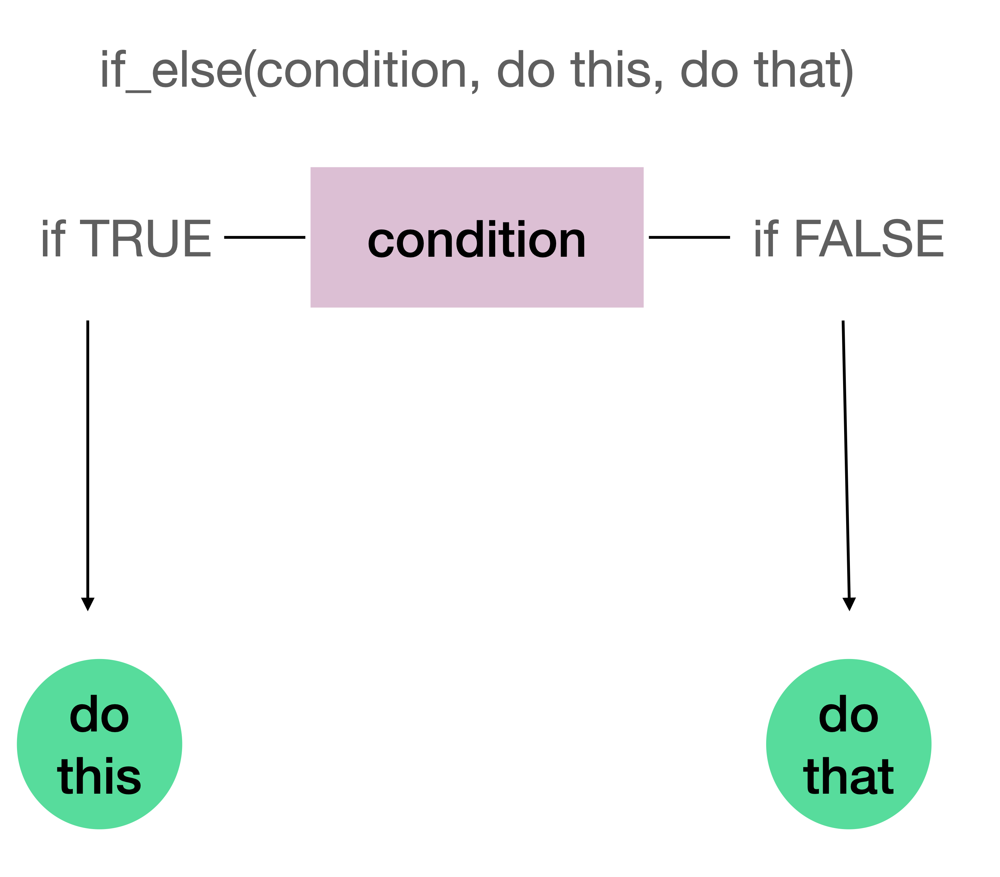
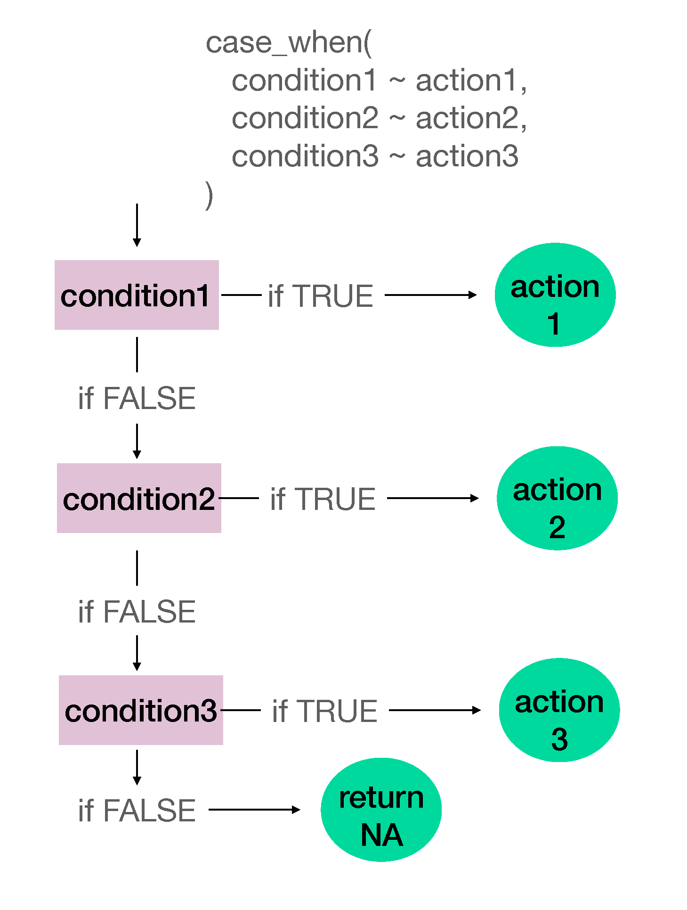
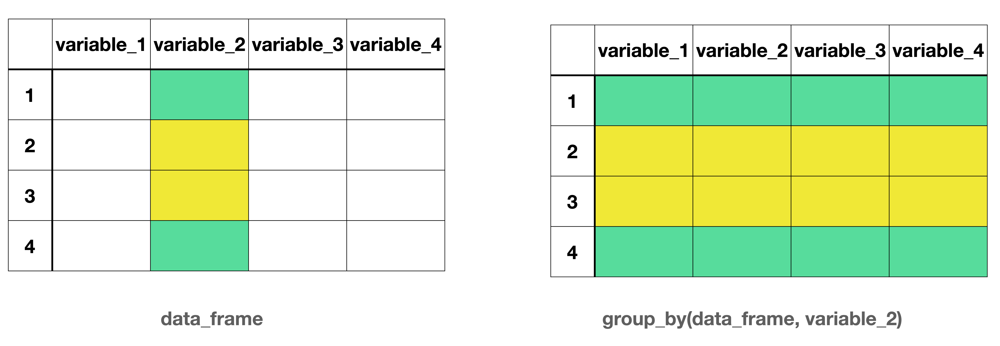

# Pipe Operator {.inverse background-color="#A51C30"}

## Three solutions to a single problem

What is the average of 4, 8, 16 approximately?

## Breaking down the question

1.What is the average of <u>4, 8, 16</u> approximately?

. . .

2.What is the <u>average</u> of 4, 8, 16 approximately?

. . .

3.What is the average of 4, 8, 16 <u>approximately</u>?


## Solution 1: Functions within Functions


```{r}
c(4, 8, 16)
```

. . .

<hr>

```{r}
mean(c(4, 8, 16))
```

. . .

<hr>

```{r}
round(mean(c(4, 8, 16)))
```


## Problem!

**Problem with writing functions within functions**

Things will get messy and more difficult to read and debug as we deal with more complex operations on data.


## Solution 2: Creating Objects


```{r}
numbers <- c(4, 8, 16)
numbers
```

. . .

<hr>

```{r}
avg_number <- mean(numbers)
avg_number
```

. . .

<hr>

```{r}
round(avg_number)
```

## Problem!

**Problem with creating many objects**

We will end up with too many objects in `Environment`. 


## Solution 3: The (forward) Pipe Operator |> 

:::{.font75}
Shortcut: <br>Ctrl (Command) + Shift + M
:::

## RStudio settings

Make sure to select `Use native pipe operator` under `Tools > Global Options > Code` in RStudio

## Reading the pipe operator

::::{.columns}

:::{.column width="50%"}

```{r}
c(4, 8, 16) |> 
  mean() |> 
  round()
```

:::

:::{.column width="50%"}
Combine 4, 8, and 16 `and then`  
Take the mean   `and then`  
Round the output
:::

::::

. . .

The output of the first function is the first argument of the second function.

## Recall functions from algebra


Now we have $f \circ g \circ h (x)$  
or `round(mean(c(4, 8, 16)))`

. . .


::::{.columns}

:::{.column width="50%"}


```{r}
#| eval: false
h(x) |> 
  g() |> 
  f()
```

:::

:::{.column width="50%"}

```{r}
#| eval: false
c(4, 8, 16) |> 
  mean() |> 
  round()
```


:::

::::


## Data

```{r}
library(tidyverse)
board_games <- 
  read_csv(
    here::here(
      "data",
      "games_detailed_info2025.csv"
    )
  ) 
```

Unless mentioned, today's functions come from the {dplyr} package which is part of tidyverse.

<hr>

[Data Documentation](https://www.kaggle.com/datasets/jvanelteren/boardgamegeek-reviews?resource=download&select=games_detailed_info2025.csv)

## Data Glimpse

```{r}
glimpse(board_games)
```


# Changing Variable Names {.inverse background-color="#A51C30"}


## Tidy style variable names

```{r}
janitor::clean_names(board_games)
```

## Rename variables

```{r}
board_games |> 
  rename(index = ...1)
```

The `rename()` function changes the name of the variable. 
The `new_variable_name` has to be set to equal to the `old_variable_name`.


The `clean_names()` function changes all variable names to tidyverse style. 

## Step 1

In fact there are many variables that do not adhere to tidyverse style convention. 
I will go ahead and rename only those that will come up in subsequent slides.

```{r}
board_games |> 
  janitor::clean_names()
```

## Step 2


```{r}
board_games |> 
  janitor::clean_names() |> 
  rename(
    index = x1,
    year_published = yearpublished,
    board_game_category = boardgamecategory,
    num_comments = numcomments,
    users_rated = usersrated,
    max_players = maxplayers,
    designer = boardgamedesigner
  )
```

## Step 3

```{r}
board_games <-
  board_games |> 
  janitor::clean_names() |> 
  rename(
    index = x1,
    year_published = yearpublished,
    board_game_category = boardgamecategory,
    num_comments = numcomments,
    users_rated = usersrated,
    max_players = maxplayers,
    designer = boardgamedesigner
  )
```

# Subsetting Data Frames {.inverse background-color="#A51C30"}

## Subsetting Variables/Columns

```{r}
#| echo: false
#| fig-alt: "Side-by-side schematic of a data frame and a subset of it. On the left, a table labeled data_frame shows four rows (1–4) and four columns named variable_1, variable_2, variable_3, and variable_4. The columns variable_2 and variable_3 are shaded in pink to indicate selection. On the right, a smaller table labeled select(data_frame, variable_2, variable_3) displays only the two shaded columns, variable_2 and variable_3, for the same four rows, illustrating how selecting columns reduces the data frame to those variables."
knitr::include_graphics("images/lec04a-subset-columns.png")
```

. . .

Column-wise subsetting can be done using `select()`.

## Subsetting Observations/Rows

```{r}
#| echo: false
#| fig-alt: "Side-by-side schematic illustrating row selection in a data frame. On the left, a table labeled data_frame shows four rows (1–4) and four columns (variable_1 to variable_4). Rows 2 and 3 are shaded in pink to indicate they are selected, while rows 1 and 4 are unshaded. On the right, a smaller table labeled filter(data_frame, condition) and slice(data_frame, row_indices) displays only the selected rows (rows 2 and 3) with all four columns preserved, demonstrating how filtering or slicing keeps rows that meet a condition."

knitr::include_graphics("images/lec04a-subset-rows.png")
```

. . .

Row-wise subsetting can be done with `slice()` and `filter()` 

## `select()`

```{r}
board_games |> 
  select(name, year_published, board_game_category, num_comments, users_rated, max_players)
```

`select()` is used to select certain variables in the data frame. 

## Dropping Variables

```{r}
board_games |> 
  select(-index)
```

`select()` can also be used to drop variables. 

. . .

Is `type` also an unnecessary variable?

## Count

```{r}
count(board_games, type)
```

## Dropping Variables

```{r}
board_games |> 
  select(-c(index, type))
```

## Selection helpers

`starts_with()`  
`ends_with()`  
`contains()` 


## `starts_with()`

```{r}
select(board_games, starts_with("boardgame"))
```

## `ends_with()`

```{r}
select(board_games, ends_with("rank"))
```

## `contains()`

```{r}
select(board_games, contains("game"))
```


## "Save" data frame

```{r}
board_games <- 
  board_games |> 
  select(
    name, 
    year_published, 
    board_game_category, 
    num_comments, 
    users_rated, 
    max_players, 
    designer
    )
```

. . . 

```{r}
glimpse(board_games)
```


## `slice()`

`slice()` subsets rows based on a row number.

The data below include all the rows from third to seventh, including the third and the seventh.

```{r}
slice(board_games, 3:7)
```

## Relational and Logical Operators

::::{.columns}


:::{.column width="50%"}


| Operator | Description              |
|----------|--------------------------|
| <        | Less than                |
| >        | Greater than             |
| <=       | Less than or equal to    |
| >=       | Greater than or equal to |
| ==       | Equal to                 |
| !=       | Not equal to             |

:::

:::{.column width="50%"}

| Operator | Description |
|----------|-------------|
| &        | and         |
| &#124;   | or          |

:::
::::


## `filter()` - Example 1

`filter()` subsets rows based on a condition.

The data below includes rows when the publication year is 2004.

```{r}
board_games |> 
  filter(year_published == 2024)
```

## Number of games - Example 1

How many games were published in 2024 based on this dataset?

```{r}
board_games |> 
  filter(year_published == 2024) |> 
  nrow()
```

## `filter()` - Example 2

How many games were in the Medical category and only in the Medical category?


```{r}
board_games |> 
  filter(board_game_category == "['Medical']")
```

## Number of games - Example 2

How many games were in the Medical category and only in the Medical category?

```{r}
board_games |> 
  filter(board_game_category == "['Medical']") |> 
  nrow()
```

## `filter()` - Example 3

How many of the games published in 2024 were in the Medical category and only in the Medical category?


```{r}
board_games |> 
  filter(year_published == 2024 & board_game_category == "['Medical']")
```

## Number of games - Example 3

How many games were in the Medical category and only in the Medical category?

```{r}
board_games |> 
  filter(year_published == 2024 & board_game_category == "['Medical']") |> 
  nrow()
```

## `filter()` - Example 4

How many of the games were either published in 2024 or were in the Medical category and only in the Medical category?


```{r}
board_games |> 
  filter(year_published == 2024 | board_game_category == "['Medical']")
```

## Number of games - Example 4

How many of the games were either published in 2024 or were in the Medical category and only in the Medical category?

```{r}
board_games |> 
  filter(year_published == 2024 | board_game_category == "['Medical']") |> 
  nrow()
```

## Multiple "or" statements with `%in%`

```{r}
specific_years <- c(1995, 2004, 2016)


board_games |>
  filter(year_published %in% specific_years)
```

## Checking for `NA` values


```{r}
board_games |> 
  filter(is.na(board_game_category))
```


# Making Changes to Variables {.inverse background-color="#A51C30"}

## Creating New Variables Using Operations Between Existing Variables

```{r}
board_games |> 
  mutate(num_comments_k = num_comments/1000)
```

## Creating New Variables Using Operations Between Existing Variables

```{r}
board_games |> 
  mutate(num_comments_k = num_comments/1000) |> 
  select(num_comments, num_comments_k)
```

## Creating New Variables Based on Conditions

```{r}
board_games |> 
  mutate(
    popularity_class = if_else(
      users_rated >= 10000,
      "Highly popular",
      "Less popular"
    )
  ) |> 
  select(users_rated, popularity_class)
```

## `if_else()` summary

```{r}
#| label: fig-if-else
#| echo: false
#| fig-alt: "Flowchart illustrating an if–else decision. At the top is the text if_else(condition, do this, do that). A central pink rectangle labeled condition branches into two paths: to the left, labeled if TRUE, an arrow points down to a green circle labeled do this; to the right, labeled if FALSE, an arrow points down to a green circle labeled do that. The diagram shows how a condition determines which action is executed."
#| out-width: 50%

```

## Creating New Variables Based on Conditions

```{r}
board_games |> 
  mutate(
    popularity_level = case_when(
      users_rated < 1000 ~ "Fewer than 1,000 ratings",
      users_rated < 10000 ~ "1,000 to 9,999 ratings",
      users_rated < 50000 ~ "10,000 to 49,999 ratings",
      users_rated >= 50000 ~ "50,000 or more ratings",
      TRUE ~ "Missing"
    )
  ) |> 
  select(users_rated, popularity_level)
```

## `case_when()` summary

```{r}
#| label: fig-case-when
#| echo: false
#| fig-alt: "Flowchart illustrating case_when logic. At the top is the text case_when(condition1 ~ action1, condition2 ~ action2, condition3 ~ action3). A vertical sequence of pink rectangles labeled condition1, condition2, and condition3 represents conditions evaluated in order. For each condition, a rightward arrow labeled if TRUE leads to a green circle labeled action1, action2, or action3, respectively. If a condition is false, the flow continues downward to the next condition. If all conditions are false, a final arrow leads to a green circle labeled return NA. The diagram shows how the first true condition determines the returned action."
#| out-width: 50%

```


## Changing Variable Type

```{r}
board_games |> 
  mutate(
    popularity_level = case_when(
      users_rated < 1000 ~ "Fewer than 1,000 ratings",
      users_rated < 10000 ~ "1,000 to 9,999 ratings",
      users_rated < 50000 ~ "10,000 to 49,999 ratings",
      users_rated >= 50000 ~ "50,000 or more ratings",
      TRUE ~ "Missing"
    ),
    popularity_level = as.factor(popularity_level)
  )
```

## Changing variable types


`as.factor()` - makes a vector factor  
`as.numeric()` - makes a vector numeric  
`as.integer()` - makes a vector integer  
`as.double()` - makes a vector double  
`as.character()` - makes a vector character  


## Cleaning in one long chain

```{r}
#| eval: false
board_games <-
  board_games |> 
  janitor::clean_names() |> 
  rename(
    index = x1,
    year_published = yearpublished,
    board_game_category = boardgamecategory,
    num_comments = numcomments,
    users_rated = usersrated,
    max_players = maxplayers
  )|> 
  select(name, year_published, board_game_category, num_comments, users_rated, max_players) |> 
  mutate(
    popularity_class = if_else(
      users_rated >= 10000,
      "Highly popular",
      "Less popular"
    ),
    popularity_level = case_when(
      users_rated < 1000 ~ "Fewer than 1,000 ratings",
      users_rated < 10000 ~ "1,000 to 9,999 ratings",
      users_rated < 50000 ~ "10,000 to 49,999 ratings",
      users_rated >= 50000 ~ "50,000 or more ratings",
      TRUE ~ "Missing"
    ),
    popularity_level = as.factor(popularity_level)
  ) 
```

## Cleaning in one long chain - glimpse

```{r}
#| echo: false
board_games <-
    read_csv(
     here::here(
      "data",
      "games_detailed_info2025.csv"
    )
  ) |> 
  janitor::clean_names() |> 
  rename(
    index = x1,
    year_published = yearpublished,
    board_game_category = boardgamecategory,
    num_comments = numcomments,
    users_rated = usersrated,
    max_players = maxplayers
  )|> 
  select(name, year_published, board_game_category, num_comments, users_rated, max_players) |> 
  mutate(
    popularity_class = if_else(
      users_rated >= 10000,
      "Highly popular",
      "Less popular"
    ),
    popularity_level = case_when(
      users_rated < 1000 ~ "Fewer than 1,000 ratings",
      users_rated < 10000 ~ "1,000 to 9,999 ratings",
      users_rated < 50000 ~ "10,000 to 49,999 ratings",
      users_rated >= 50000 ~ "50,000 or more ratings",
      TRUE ~ "Missing"
    ),
    popularity_level = as.factor(popularity_level)
  ) 
```

```{r}
glimpse(board_games)
```

## Pay attention to first argument

::: {.stat-callout .note-tip}

The functions `clean_names()`, `select()`, `filter()`, `mutate()` all take a data frame as the first argument. Even though we do not see it, the data frame is piped through from the previous step of code at each step. 
When we use these functions without the `|>` we have to include the data frame explicitly.

::::{.columns}
:::{.column width="50%"}
Data frame is used as the first argument
```{r}
#| eval: false
clean_names(board_games)
```
:::

:::{.column width="50%"}
Data frame is piped

```{r}
#| eval: false
board_games |> 
  clean_names()
```
:::
::::
:::

# Aggregating Data {.inverse background-color="#A51C30"}

## Data vs. Aggregate Data

::::{.columns}
:::{.column width="50%"}
### Data
Observations
:::

:::{.column width="50%"}
### Aggregate Data
Summaries of observations
:::
::::

## Aggregating Categorical Data

Categorical data are summarized with **counts** or **proportions**.

## Counts and proportions


```{r}
board_games |> 
  count(popularity_level)
```

. . .

```{r}
board_games |> 
  count(popularity_level) |> 
  mutate(prop = n/sum(n))
```

## Aggregating Numerical Data

Mean, median, standard deviation, variance, and quartiles are some of the numerical summaries of numerical variables. Recall


```{r}
summarize(board_games, 
          mean_num_comments = mean(num_comments),
          sd_num_comments = sd(num_comments))
```

## Aggregating Data By Groups

```{r}
#| label: fig-group-by
#| echo: false
#| fig.cap: Grouping a data frame by a specific variable
#| fig-alt: "Side-by-side schematic illustrating grouping in a data frame. On the left, a table labeled data_frame shows four rows (1–4) and four columns (variable_1 to variable_4). Values in variable_2 are highlighted with two colors, indicating two groups: rows 1 and 4 share one group, and rows 2 and 3 share another. On the right, a table labeled group_by(data_frame, variable_2) shows the same data with all columns present, but rows are visually grouped by variable_2, using the same colors across all columns to indicate group membership."

```

`group_by()` separates the data frame by the groups. Any action following `group_by()` will be completed for each group separately.

## Example

Q. What is the median number of comments for each popularity level?

## Example

```{r}
board_games |> 
  group_by(popularity_level)
```

## Example

Note that when `group_by()` is used there have been no changes to the number of columns or rows. 
The only difference we can observe is now `Groups: popularity_level[4]` is displayed indicating the data frame (i.e., tibble) is divided into three groups.

## Example

```{r}
board_games |> 
  group_by(popularity_level) |> 
  summarize(med_num_comments = median(num_comments))
```

## Example

We can also add how many board games there were in each group.

```{r}
board_games |> 
  group_by(popularity_level) |> 
  summarize(med_num_comments = median(num_comments),
            count = n())
```

Note that `n()` does not take any arguments.


