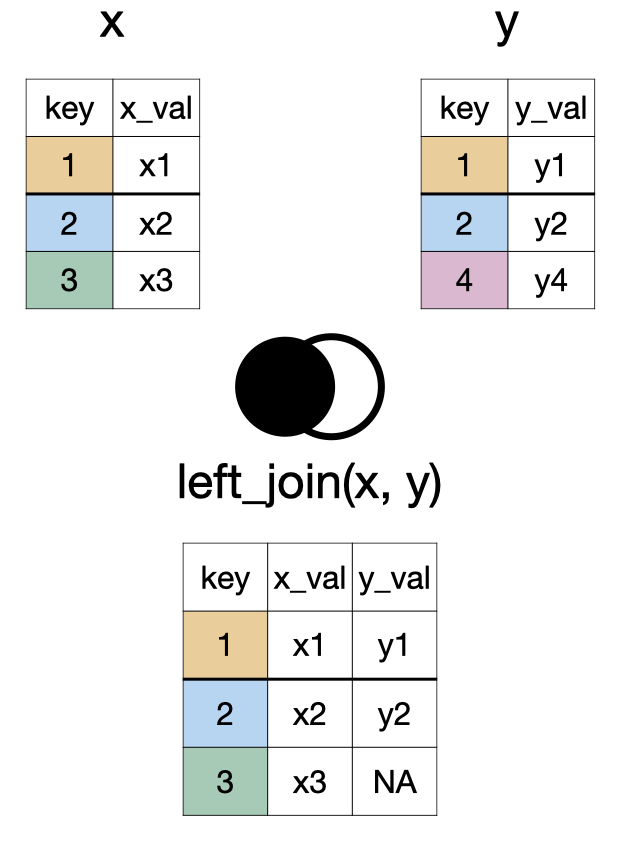
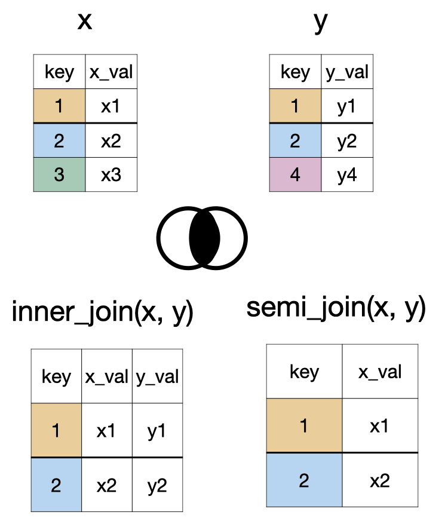

```{r}
#| echo: false
library(tidyverse)
artists <- readxl::read_xlsx("data/spotify.xlsx", sheet = "artist")
songs <- readxl::read_xlsx("data/spotify.xlsx", sheet = "top_song")
albums <- readxl::read_xlsx("data/spotify.xlsx", sheet = "album") |> 
  mutate(album_release_date = lubridate::ymd(album_release_date))
```


# Joining Datasets {.inverse background-color="#A51C30"}

## `left_join(x, y)`

```{r}
#| echo: false
#| fig-align: center
#| fig-alt: "A diagram showing two tables, X and Y, being combined into a new table. Table X has columns 'key' and 'x_val', with keys 1, 2, 3. Table Y has 'key' and 'y_val', with keys 1, 2, 4. The new combined table includes all rows from Table X. For each key present in both tables (1 and 2), the matching 'y_val' from Table Y is added. For keys only in Table X (key 3), the 'y_val' column is filled with 'NA' (Not Applicable)"

```

## `right_join(x, y)`


```{r}
#| echo: false
#| fig-align: center
#| out-width: 45% 
#| fig-alt: "A diagram showing two tables, X and Y, being merged based on a shared 'key' column. Table X has keys 1, 2, 3; Table Y has keys 1, 2, 4. The resulting combined table contains all rows from Table Y. Where keys match in both tables (1 and 2), corresponding values from X are included. For keys only present in Y (key 4), the 'x_val' column shows 'NA' (Not Applicable)."
knitr::include_graphics("images/lec05b-right-join.png")
```

## `full_join(x, y)`


```{r}
#| echo: false
#| fig-align: center
#| out-width: 45% 
#| fig-alt: "A diagram showing two tables, X and Y, being merged based on a shared 'key' column into a new combined table. Table X has keys 1, 2, 3; Table Y has keys 1, 2, 4. The resulting table includes all keys present in either X or Y (keys 1, 2, 3, 4). For keys found in both tables (1 and 2), corresponding values from both X ('x_val') and Y ('y_val') are shown. For keys only in Table X (key 3), its 'x_val' is included, and 'y_val' is marked 'NA' (Not Applicable). For keys only in Table Y (key 4), its 'y_val' is included, and 'x_val' is marked 'NA'"
knitr::include_graphics("images/lec05b-full-join.png")
```

## `inner_join(x, y)` and `semi_join(x, y)`

```{r}
#| echo: false
#| fig-align: center
#| out-width: 45% 
#| fig-alt: "A diagram showing two ways to process data from two tables, X and Y, based on a common 'key' column. Table X has keys 1, 2, 3, with an 'x_val' for each. Table Y has keys 1, 2, 4, with a 'y_val' for each. 1.  Inner Combine (labeled 'inner_join'): A new table is created that only includes rows where the 'key' is found in *both* Table X and Table Y (keys 1 and 2). For these matching keys, the new table displays the key, its 'x_val' from Table X, and its 'y_val' from Table Y. 2. Semi Combine (labeled 'semi_join'): A new table is created by taking only those rows from Table X whose 'key' also  appears in Table Y (keys 1 and 2). This new table only displays the 'key' and 'x_val' from Table X."

```

## `anti_join(x, y)`

```{r}
#| echo: false
#| fig-align: center
#| out-width: 45% 
#| fig-alt: "A diagram showing two tables, X and Y, being processed to create a new table. Table X has keys 1, 2, 3, with corresponding 'x_val' values. Table Y has keys 1, 2, 4, with corresponding 'y_val' values. The new table, labeled 'anti_join(x, y)', is formed by taking only those rows from Table X whose 'key' is *not* found in Table Y. In this example, only the row with key 3 from Table X (and its 'x_val') is included in the final result."
knitr::include_graphics("images/lec05b-anti-join.png")
```

## `something_join(x, y)`


<table aria-label="Comparison of dplyr join functions by row and column retention">
  <thead>
  <tr>
  <th scope="col">Function</th> <th colspan="2" scope="colgroup" style="text-align: center">x </th>
  <th colspan="2" scope="colgroup" style="text-align: center">y </th>
  </tr>
  <tr>
  <th scope="col">Type</th> <th scope="col">rows</th>
  <th scope="col">columns</th>
  <th scope="col">rows</th>
  <th scope="col">columns</th>
  </tr>
  </thead>
  <tbody>
  
  <tr>
  <td>`left_join()`</td>
  <td>all</td>
  <td>all</td>
  <td>matched</td>
  <td>all</td>
  </tr>
  <tr>
  <td>`right_join()`</td>
  <td>matched</td>
  <td>all</td>
  <td>all</td>
  <td>all</td>
  </tr>
  <tr>
  <td>`full_join()`</td>
  <td>all</td>
  <td>all</td>
  <td>all</td>
  <td>all</td>
  </tr>
  <tr>
  <td>`inner_join()`</td>
  <td>matched</td>
  <td>all</td>
  <td>matched</td>
  <td>all</td>
  </tr>
  <tr>
  <td>`semi_join()`</td>
  <td>matched</td>
  <td>all</td>
  <td>none</td>
  <td>none</td>
  </tr>
  <tr>
  <td>`anti_join()`</td>
  <td>unmatched</td>
  <td>all</td>
  <td>none</td>
  <td>none</td>
  </tr>
  </tbody>
  </table>
  
## Data
  
::: {.panel-tabset}

## artists

```{r}
artists
```

## songs

```{r}
songs
```

## albums

```{r}
albums
```


:::
  
## Relational Schema
  
```{r}
#| echo: false
#| fig-align: center
#| fig-alt: "A diagram shows three related collections of music information: 'artist', 'songs', and 'albums'. The 'artist' collection includes the artist's name and their number of followers. The 'songs' collection lists the artist's name, the song's name, the album's name it's on, and its popularity. The 'albums' collection contains the album's name and its release date. Lines connect the artist's name from the 'artist' collection to the artist's name in the 'songs' collection, and similarly, album names link the 'songs' collection to the 'albums' collection. This structure connects song details to their respective artists and albums."
knitr::include_graphics("images/lec05b-data-joins-spotify.png")
```

## `left_join()`

```{r}
left_join(songs, artists)
```

## `right_join()`


```{r}
right_join(songs, artists)
```


## `full_join()`

```{r}
full_join(songs, artists, by = "name")
```

## `full_join()` x2

```{r}
full_join(songs, artists, by = "name") |> 
  full_join(albums, by = "album_name")
```

# Reading (Importing) Datasets {.inverse background-color="#A51C30"}

## Importing .csv Data 


```{r}
#| echo: true
#| eval: false
readr::read_csv("dataset.csv")
```


## Importing Excel Data

```{r}
#| echo: true
#| eval: false
readxl::read_excel("dataset.xlsx")
```


## Importing Excel Data

```{r}
#| echo: true
#| eval: false
readxl::read_excel("dataset.xlsx", sheet = 2)
```


## Importing SAS, SPSS, Stata Data

```{r}
#| echo: true
#| eval: false
library(haven)
# SAS
read_sas("dataset.sas7bdat")
# SPSS
read_sav("dataset.sav")
# Stata
read_dta("dataset.dta")
```


## Where is the dataset file?

Importing data will depend on where the dataset is on your computer. However we use the help of `here::here()` function. 
This function sets the working directory to the project folder (i.e. where the `.Rproj` file is).

```{r}
#| echo: true
#| eval: false
read_csv(here::here("data/dataset.csv"))
```

# Pivoting Datasets {.inverse background-color="#A51C30"}

## Pivoting

In tidyverse (specifically {tidyr}), pivoting refers to reshaping a data frame so that it is either:

longer: more rows, fewer columns, or  
wider: fewer rows, more columns.


## Data

`gapminder` is in **long format**: one row per country-year

```{r}
library(gapminder)
data(gapminder)
gapminder
```


## `pivot_wider()`: Long → Wide

```{r}
#| echo: true
life_wide <- gapminder |>
  select(country, year, lifeExp) |>
  pivot_wider(
    names_from = year,
    values_from = lifeExp
  )

life_wide
```


## `pivot_wider()`: What Happened?

```r
pivot_wider(
  names_from = year,     # column whose VALUES become new column names
  values_from = lifeExp  # column whose VALUES fill the new columns
)
```

- Each unique `year` becomes its own column
- `lifeExp` values get spread into those columns
- One row per `country` remains

Great for **making tables** or **comparing across time** side by side.

---

## `pivot_longer()`: Wide → Long

Now reverse it — take `life_wide` back to long format:

```{r}
#| echo: true
life_long <- life_wide |>
  pivot_longer(
    cols = -country,          # all columns except country
    names_to = "year",
    values_to = "lifeExp"
  )

life_long
```

---

## `pivot_longer()`: What Happened?

```r
pivot_longer(
  cols = -country,       # columns to gather (all but country)
  names_to = "year",      # new column to hold old column NAMES
  values_to = "lifeExp"   # new column to hold the VALUES
)
```

- Many columns collapse into two: `year` and `lifeExp`
- `country` is repeated across rows
- This is the tidy, "one row per observation" shape


## Why Go Wide → Long?


```{r}
#| echo: true
#| fig-align: center
#| fig-alt: a geom line graph with year on the x axis and life expectancy on the y-axis. The years range from about 1950 to 2010. There are three trajectory lines for three countries Canada, China, and Nigeria.
life_long |>
  mutate(year = as.numeric(year)) |>
  filter(country %in% c("Canada", "China", "Nigeria")) |>
  ggplot(aes(year, lifeExp, color = country)) +
  geom_line() +
  theme_minimal(base_size = 20)
```


## Why Go Long → Wide?


```{r}
#| echo: true
gapminder |>
  filter(continent == "Oceania") |>
  select(country, year, gdpPercap) |>
  pivot_wider(names_from = country, values_from = gdpPercap)
```

## Fun side track

The {ggplot2} package has many "extensions" by the [tidyverse team](https://exts.ggplot2.tidyverse.org/) and others in the community.

. . .

One of these packages is {gganimate} which [shows an excellent use of the `gapminder` data](https://gganimate.com/).

. . .

If you like thinking about data and public health, you might like Hans Rosling's talk [The best stats you've ever seen](https://www.ted.com/talks/hans_rosling_the_best_stats_you_ve_ever_seen). You can also take the [Gapminder Test](https://upgrader.gapminder.org/t/2017-gapminder-test?tab=q). 