```{r}
#| echo: false
library(tidyverse)
library(gapminder)
```

# Team Project Proposal {.inverse background-color="#A51C30"}

## Meet your teammates 

- You will work with your team for the rest of the term.
- Sit with your teammates in lectures and sections.
- Each team has a GitHub repository named `project-teamXX`, where `XX` is your team number (e.g., `project-team07`).

## End goal

The end goal is a short (about 3-page) research paper reporting

- the research questions your project seeks to answer  
- the background and significance of the research  
- the methods used to collect and/or analyze the data  
- the results of the analysis, in light of the assumptions made, and their interpretation in the data context  
- a discussion of the findings, including the limitations of the research and suggestions for future research on the topic  

. . .

Past [USCLAP winners](https://www.causeweb.org/usproc/projects/winners) for introductory statistics classes can serve as examples.

## Three milestones

In the first half of the term, your team builds a **proposal** in three milestones:

| Milestone | Due |
|------------------------------------|----------------------|
| **1. Data:** choose your data and document it in a `data/` folder with a README | Fri, Oct 16, 5:00 pm |
| **2. Introduction:** write the introduction of your paper, ending with your research questions | Fri, Oct 23, 5:00 pm |
| **3. Exploratory data analysis:** explore your data with visualizations, tables, and summary statistics | Wed, Nov 4, 5:00 pm |

. . .

You are **not** expected to fully answer your research questions yet. Modeling and inference come later in the term.

## Submitting milestones

- You submit each milestone by committing and pushing to your team's repo.
- **The version of your repository on GitHub at the deadline is the version that will be graded.**
- Commit and push early and often.
- Every milestone ends with a checklist. Use it before you submit.

## Project repo content

:::: {.columns}

::: {.column width="25%"}
```
project-teamXX/
├── .gitignore
├── README.md
├── project-teamXX.Rproj
├── data/
│   ├── README.md
│   ├── raw/
│   ├── processed/
│   └── clean-data.qmd
└── paper/
    ├── paper.qmd
    └── references.bib
```
:::

::: {.column width="75%"}
- `.gitignore`: files Git should ignore
- `README.md`: short description of your project
- `data/README.md`: documentation for your data
- `data/raw/`: data exactly as downloaded; never edit these files
- `data/processed/`: cleaned data created by code
- `data/clean-data.qmd`: code that turns `raw/` into `processed/`
- `paper/`: your paper and references (starting in Milestone 2)
:::

::::

## Reproducibility 

A project is **computationally reproducible** when an independent data scientist (or you, a few months from now) can take your exact data, source code, and software environment, rerun the entire pipeline, and obtain the exact same results, figures, and tables. 

. . .

Essentially, it means you have tracked your steps clearly enough that your claims can be verified by others or by your future self.

## Habits for a reproducible project

- **Never edit raw data by hand.** Files in `data/raw/` stay exactly as you downloaded them.
- **Do all cleaning in code.** Filtering, selecting variables, renaming, recoding, handling missing values, and joining all happen in `data/clean-data.qmd`, which reads from `data/raw/` and writes to `data/processed/`.
- **Use the `here` package for file paths** so that your code runs on anyone's computer.
- **Make sure your code runs from start to finish** on a fresh copy of the repository without errors.

## The `here` package

```r
# works only on one computer
read_csv("/Users/mine/Desktop/project-team07/data/processed/my-data.csv")

# works on everyone's computer
read_csv(here::here("data/processed/my-data.csv"))
```

. . .

`here::here()` builds file paths starting from the project folder (where the `.Rproj` file is), no matter which subfolder your `.qmd` file is in. 
So the same path works in `data/clean-data.qmd` and in `paper/paper.qmd`.

# Naming files {.inverse background-color="#A51C30"}

## 1. Be Descriptive and Concise

- Use names that clearly indicate the file's content or purpose.
- Avoid vague names like `Untitled.qmd` or `document.qmd`.
- Example: `paper.qmd` and `clean-data.qmd`

## 2. Use Consistent Naming Conventions

Common conventions include:

**snake_case**: words_separated_by_underscores  
**kebab-case**: words-separated-by-hyphens  
**camelCase**: wordsJoinedWithCapitals  
**PascalCase**: WordsJoinedWithCapitals  

Following the [tidyverse style guide](https://style.tidyverse.org/), we use `snake_case` for object names in R and `kebab-case` for file and folder names.

## 3. Avoid Special Characters and Spaces

- Do not use spaces, slashes (`/` or `\`), colons (`:`), asterisks (`*`), question marks (`?`), or quotes.
- Spaces can cause issues in some systems. Use hyphens (or underscores) instead.

## 4. Include Dates When Relevant

- Use the ISO 8601 format (YYYY-MM-DD) so that files sort in chronological order.

- Example: `meeting-notes-2026-10-05.md`

## 5. Use Numbers and/or Letters for Easy Sorting

- Start file names with numbers and/or letters so they sort in the order you use them.
- Example: `01b-intro-tools.qmd`, `02b-intro-data.qmd`
    - `01` represents the week of the term
    - `a` represents Monday and `b` represents Wednesday
- Use leading zeros (`01`, `02`, ..., `10`). Otherwise `10-...` would be sorted before `2-...`.


# README files {.inverse background-color="#A51C30"}

## README.md

- A README file is the first file people read. In our case, a reader might be our future self, a teammate, a course assistant, or (if the repo is public) anyone.

- It should be brief but detailed enough to help readers navigate the project.

- There can be multiple README files in a project: e.g., one for the whole project folder and another for the `data` subfolder. A data README can contain the codebook (data dictionary).

## README.md

- A README should be up to date. Update it throughout the project's life cycle as needed.

- On GitHub, we write README files in Markdown (`README.md`). Good news: [emojis are supported.](https://gist.github.com/rxaviers/7360908)

## README examples

- [STAT 100 website](https://github.com/stat100-fa26/course-website)
- [Museum of Modern Art Collection](https://github.com/MuseumofModernArt/collection)
- [R package bayesrules](https://github.com/bayes-rules/bayesrules)

# Data {.inverse background-color="#A51C30"}

## Finding data

- [Places to find data](https://hellodata-science.github.io/places-to-find-data/), a list of data sources for projects like this one
- Harvard Library's [Data Resources guide](https://guides.library.harvard.edu/data/home)
- Harvard Library's [Navigating the Dataset Landscape](https://guides.library.harvard.edu/c.php?g=1435201&p=10663854)
- [Data Navigator](https://chatgpt.com/g/g-68c05702a4248191b89abc6bd7dd00e6-data-navigator), a custom GPT in Harvard's ChatGPT Edu environment. Verify that any data set it suggests actually exists.

You are not limited to using only these resources.

## Host vs. source

Not all publicly available data are real. 
There are many artifical datasets on some sites (e.g., Kaggle).

- The **host** is the site you download the data from.
- The **source** is the person or organization that actually collected the data.

. . .

Before you commit to a data set, trace it back to its original source and make sure the data are real, the source is credible, and you can find out how the data were collected.

## Data documentation

`data/README.md` is the perfect place to document your data. It should include

1. **Source and citation:** who created the data, where you downloaded it from (URL), and when you downloaded it. The retrieval date is important because data can get updated. For instance, the data might be published by the City of Cambridge or a group of researchers at MIT but hosted by Kaggle. Cite the original source and where the data are hosted.
2. **How the data were collected:** who or what was measured, when, where, how, and why.


## Data documentation

3. **Observational unit:** what one row represents (a person, a county, a song, a game, a day).
4. **Files:** every file in `data/raw/` and `data/processed/`, with a one-line description and its number of rows and columns.
5. **Codebook:** a table describing each variable you plan to use.
6. **Processing steps:** a short summary of what your cleaning code does to get from `raw/` to `processed/`.
7. **License or terms of use**, if the source lists one.

## Codebook example {.smaller}

The `gapminder` data from the `gapminder` R package:

| Variable | Description | Type | Units or values |
|-----------|----------------------------|-------------|--------------------------------|
| `country` | Name of the country | categorical | 142 countries |
| `continent` | Continent of the country | categorical | Africa, Americas, Asia, Europe, Oceania |
| `year` | Year of the measurement | numerical | 1952 to 2007, every 5 years |
| `lifeExp` | Life expectancy at birth | numerical | years |
| `pop` | Population | numerical | number of people |
| `gdpPercap` | GDP per capita | numerical | US\$, inflation-adjusted |

. . .

Also note how missing values are coded. Some surveys use codes like 77, 99, or -1 for "don't know" or "refused."

# Collaboration on GitHub {.inverse background-color="#A51C30"}

## Collaboration on GitHub

```{r}
#| echo: false
#| fig-align: center
#| out-width: "90%"
#| fig-alt: 'Four icons on a white background: an orange monitor, a black GitHub logo, a green monitor are in a vertical line top to bottom. To the right of the GitHub icon is a black square.'
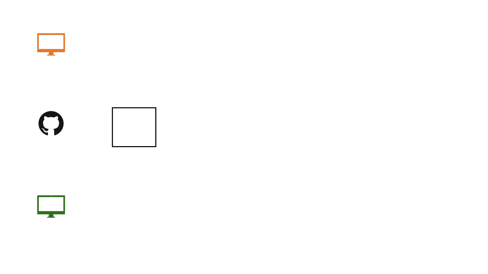
```

## Collaboration on GitHub


```{r}
#| echo: false
#| out-width: "90%"
#| fig-align: center
#| fig-alt: 'A diagram on a white background with three rows. Each row contains an icon and an empty square outline. The icons are, from top to bottom: an orange monitor, a black GitHub logo, and a green monitor. Below the rows, text reads: "Both collaborators can clone the repo."'
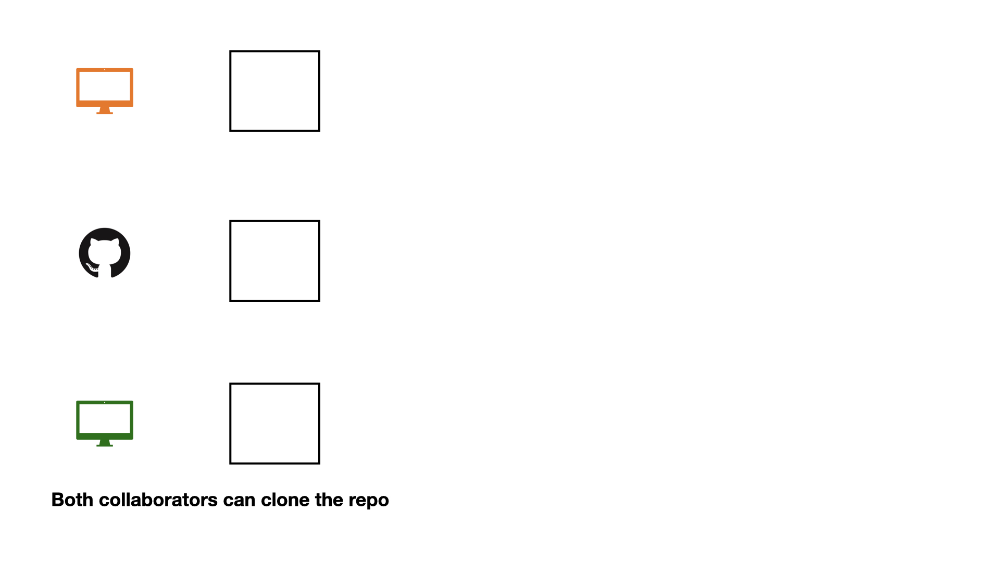
```

## Collaboration on GitHub


```{r}
#| echo: false
#| out-width: "90%"
#| fig-align: center
#| fig-alt: "Three rows of icons and outlined squares on a white background. The top row shows an orange monitor and a black square outline. The middle row has a black GitHub logo and a black square outline. The bottom row displays a green monitor, a black square outline, the word 'Commit', and a green square outline. Below, text reads: 'Each change is made by one collaborator at a time.'"
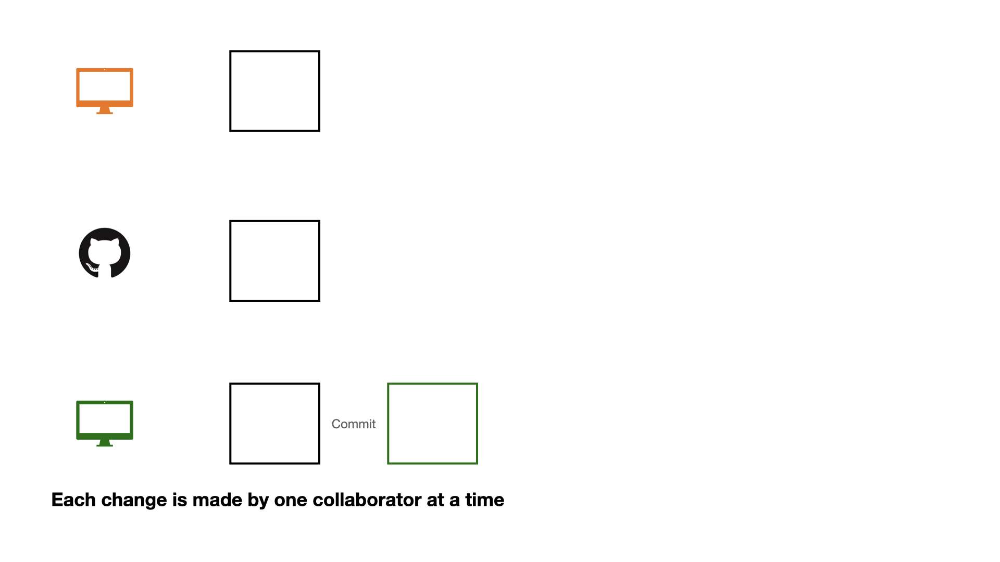
```

## Collaboration on GitHub


```{r}
#| echo: false
#| out-width: "90%"
#| fig-align: center
#| fig-alt: 'A diagram on a white background with three rows. The top row shows an orange monitor and an empty square. The middle row has a GitHub logo, an empty square, and a green square with "Push" written below it. The bottom row displays a green monitor, an empty square, "Commit", and a green square. Below the rows, text reads: "Each change is made by one collaborator at a time."'
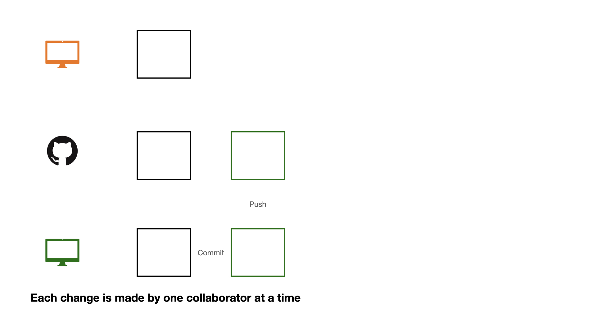
```

## Collaboration on GitHub


```{r}
#| echo: false
#| out-width: "90%"
#| fig-align: center
#| fig-alt: 'A diagram on a white background with three rows. The top row shows an orange monitor, an empty black square, and an empty green square labeled "Pull". The middle row has a black GitHub logo, an empty black square, and an empty green square labeled "Push". The bottom row displays a green monitor, an empty black square, the text "Commit", and an empty green square. Below, text reads: "Each change is made by one collaborator at a time."'
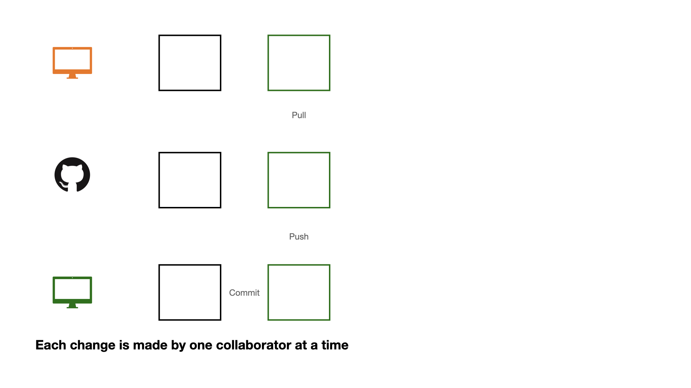
```

## Collaboration on GitHub

```{r}
#| echo: false
#| out-width: "90%"
#| fig-align: center
#| fig-alt: "A three-row diagram on a white background. Row 1: An orange monitor icon, a black outlined square, a green outlined square with 'Pull' text below, then the word 'Commit' and an orange outlined square. Row 2: A black GitHub logo, a black outlined square, and a green outlined square with 'Push' text below. Row 3: A green monitor icon, a black outlined square, then the word 'Commit' and a green outlined square. Below the diagram, text reads: 'Each change is made by one collaborator at a time.'"
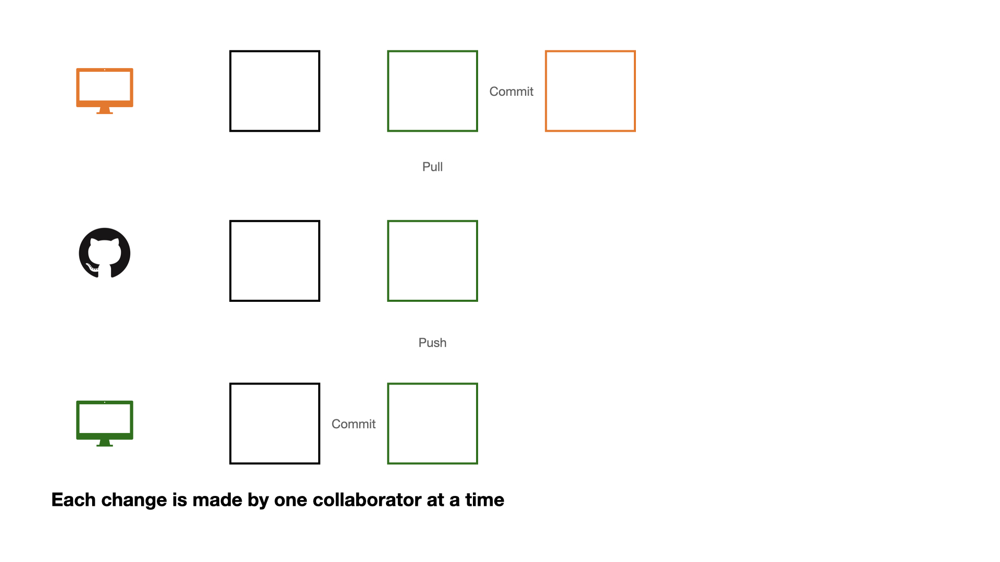
```

## Collaboration on GitHub


```{r}
#| echo: false
#| out-width: "90%"
#| fig-align: center
#| fig-alt: "A three-row diagram illustrating a Git workflow on a white background. Row 1: An orange monitor, a black square, a green square with 'Pull' below, then 'Commit' leading to an orange square with 'Push' below. Row 2: A GitHub logo, a black square, a green square with 'Push' below, and an orange square. Row 3: A green monitor, a black square, then 'Commit' leading to a green square. A caption reads: 'Each change is made by one collaborator at a time'."
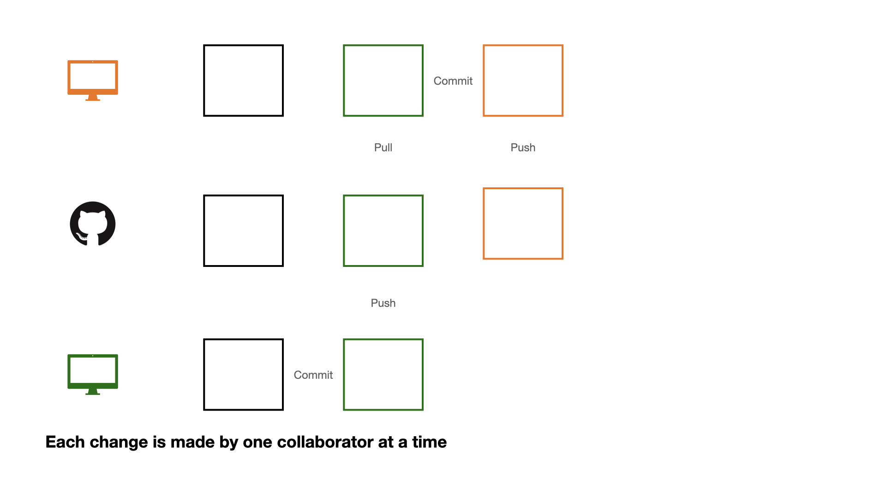
```

## Collaboration on GitHub

Making changes one collaborator at a time works, but it is not an efficient workflow: everyone has to wait for everyone else.

Instead, collaborators can work at the same time.

## Collaboration on GitHub


```{r}
#| echo: false
#| out-width: "90%"
#| fig-align: center
#| fig-alt: 'A three-row diagram on a white background, illustrating a collaborative workflow. Row 1: An orange monitor connected by a "Commit" arrow from a square containing "Part1, Part2" to a square with "Part1, Image, Part2". Row 2: A GitHub logo next to two squares, both containing "Part1, Part2". Row 3: A green monitor connected by a "Commit" arrow from a square containing "Part1, Part2" to a square with "Part1, Part2, Some code". Below the diagram, text reads: "Collaborators decide which parts (issue) each collaborator works on in advance".'
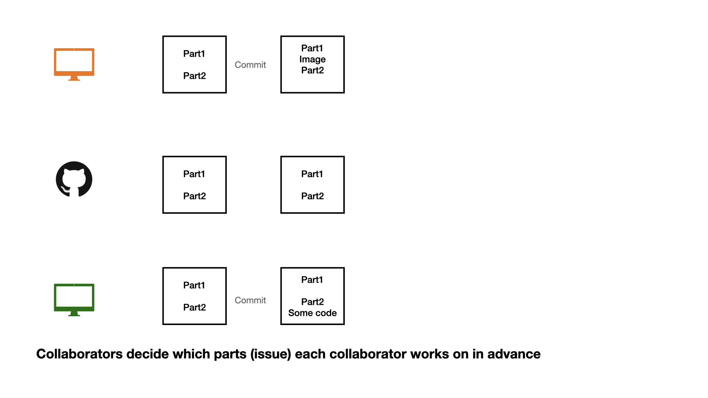
```

## Collaboration on GitHub


```{r}
#| echo: false
#| out-width: "90%"
#| fig-align: center
#| fig-alt: 'A three-row diagram on a white background, illustrating a collaborative workflow. Row 1: An orange monitor connected by a "Commit" arrow from a square containing "Part1, Part2" to a square with "Part1, Image, Part2". Row 2: A GitHub logo next to a square containing "Part1, Part2", connected to a square containing "Part1, Part2, Some code" with "Push" written below. Row 3: A green monitor connected by a "Commit" arrow from a square containing "Part1, Part2" to a square with "Part1, Part2, Some code". Below the diagram, text reads: "Collaborators decide which parts (issue) each collaborator works on in advance"'
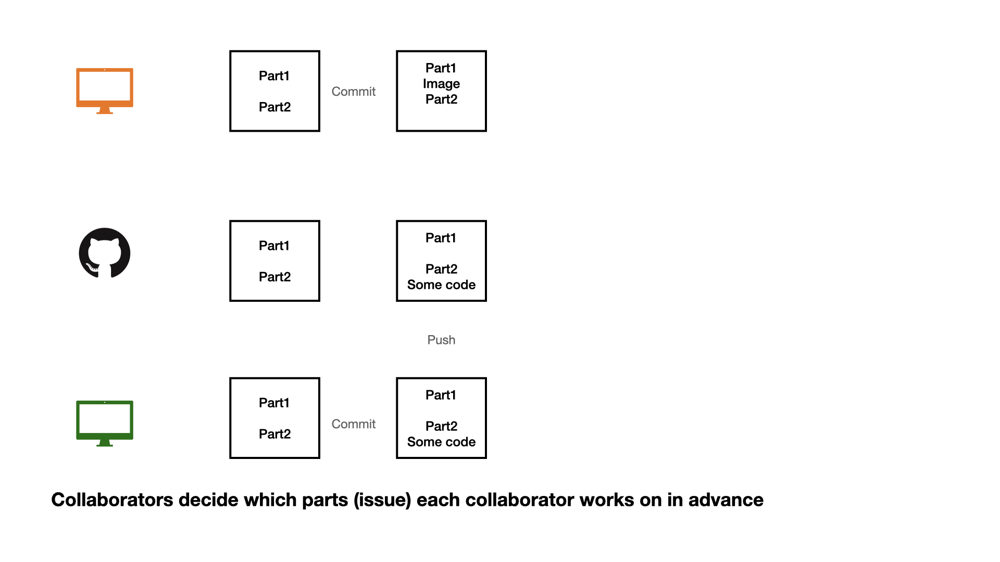
```

## Collaboration on GitHub

```{r}
#| echo: false
#| out-width: "90%"
#| fig-align: center
#| fig-alt: 'A three-row diagram on a white background illustrates a collaborative coding workflow. Row 1: An orange monitor icon, a square with "Part1, Part2", an arrow labeled "Commit" pointing to a square with "Part1, Image, Part2, Some code", and "Pull" below it. Row 2: A GitHub logo, a square with "Part1, Part2", and a square with "Part1, Part2, Some code", with "Push" below it. Row 3: A green monitor icon, a square with "Part1, Part2", and an arrow labeled "Commit" pointing to a square with "Part1, Part2, Some code". A caption below reads: "Collaborators decide which parts (issue) each collaborator works on in advance."'
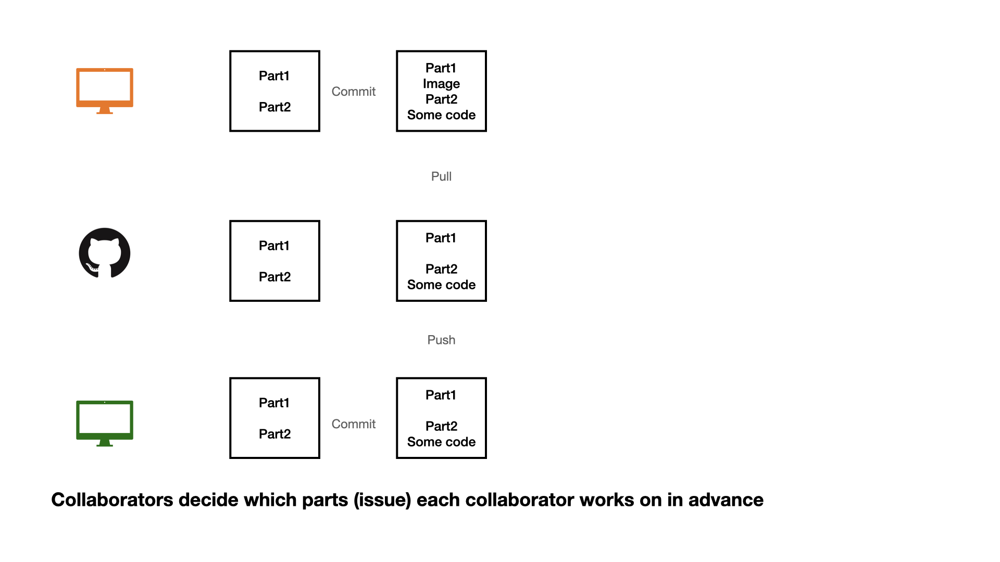
```

## Collaboration on GitHub

When collaborators work at the same time, follow this order:

1 - commit

2 - pull (very important)

3 - push


## Collaboration on GitHub


```{r}
#| echo: false
#| out-width: "90%"
#| fig-align: center
#| fig-alt: 'A three-row diagram on a white background. Row 1: An orange monitor icon, a square labeled "Part1, Part2", an arrow labeled "Commit" to a square labeled "Part1, Part2, Other Code". Row 2: A GitHub logo, a square labeled "Part1, Part2", and a square labeled "Part1, Part2, Some code" with "Push" below. Row 3: A green monitor icon, a square labeled "Part1, Part2", and an arrow labeled "Commit" to a square labeled "Part1, Part2, Some code". Below the diagram, text reads: "Collaborators do not decide which parts (issue) each collaborator works on in advance."'
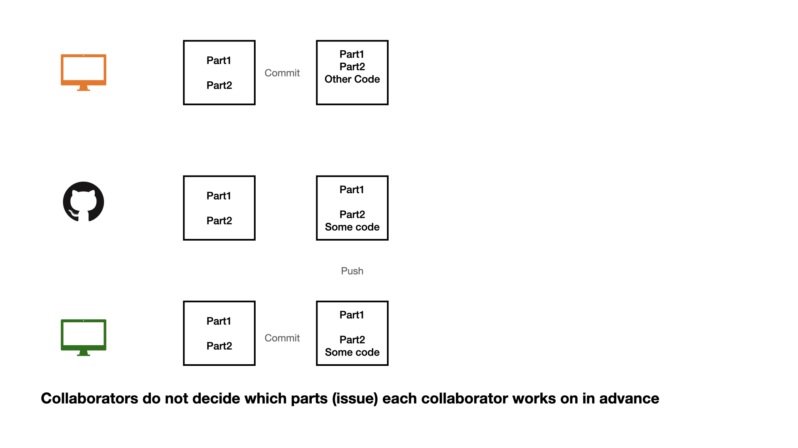
```


## Collaboration on GitHub


```{r}
#| echo: false
#| out-width: "90%"
#| fig-align: center
#| fig-alt: 'A three-row diagram illustrating uncoordinated Git collaboration. The top row (orange monitor) shows a commit adding "Other Code," followed by a "Pull" that results in a red "Merge Conflict" warning. The middle row (GitHub logo) shows existing code then a "Push" of "Some code." The bottom row (green monitor) shows a commit adding "Some code." A caption states: "Collaborators do not decide which parts (issue) each collaborator works on in advance."'
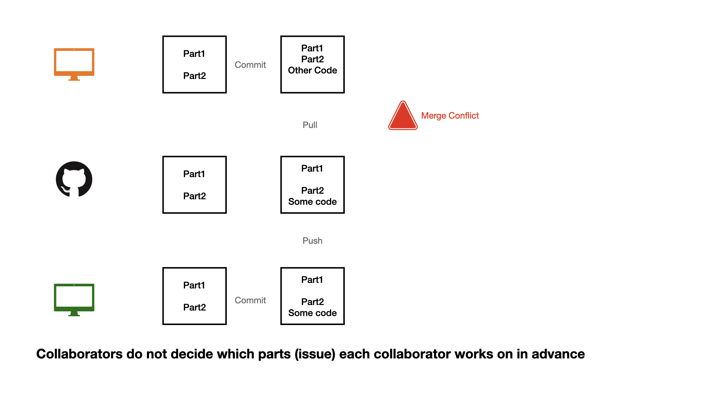
```


## Collaboration on GitHub


```{r}
#| echo: false
#| out-width: "90%"
#| fig-align: center
#| fig-alt: 'An explanation of a Git merge conflict, showing: `<<<<<<<HEAD` for local "Other Code", a `==========` merge divider, "Some Code" for the GitHub version, and `>>>>>>> alphanumeric hash` to identify the remote commit.'
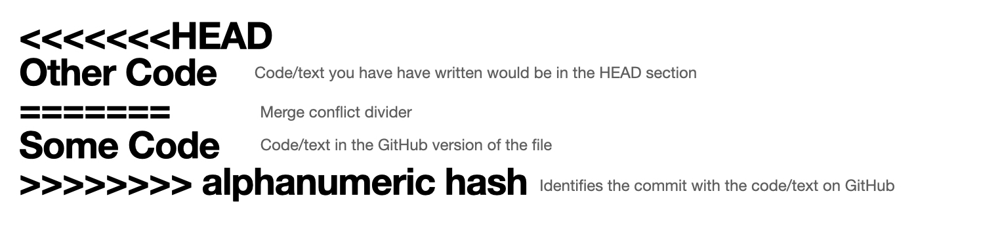
```


## Resolving a merge conflict

1. Open the file with the conflict.
2. Decide what to keep: your version, your teammate's version, or a combination of the two.
3. Delete the conflict markers (`<<<<<<<`, `=======`, `>>>>>>>`).
4. Commit and push.

. . .

The best way to deal with merge conflicts is to avoid them. Agree in advance on who is editing which file or section at a given time, and always pull before you start working.


## Opening an issue

```{r}
#| echo: false
#| out-width: "90%"
#| fig-align: center
#| fig-alt: 'A screenshot of a GitHub "New issue" page in dark mode. The issue title is "Add alternate text" and the description says "In week 4, Monday lectures slides images seem to missing alternate text. Please add them." On the right, "Assignees", "Labels", "Projects", "Milestone", and "Linked pull requests" are all empty. A green "Submit new issue" button is visible at the bottom.'
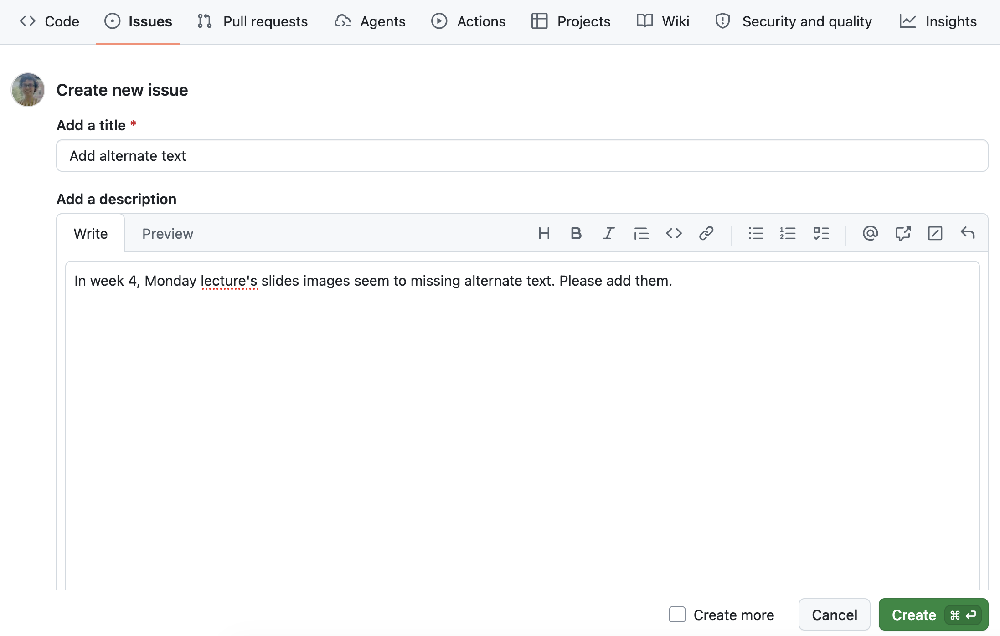
```

We can create an **issue** to keep track of mistakes to fix, ideas to discuss with teammates, or to-do tasks. You can assign issues to yourself or your teammates.

## Closing an issue

```{r}
#| echo: false
#| out-width: "90%"
#| fig-align: center
#| fig-alt: "The image shows a GitHub issue titled Week 4 slides and has text that reads #1 opened 1 minute ago by mdogucu"
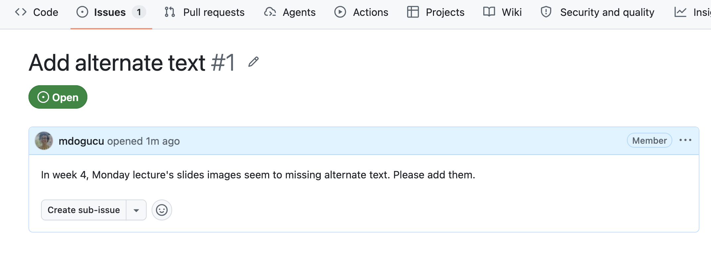
```

If you are working on an issue, it makes sense to refer to the issue number in your commit message (e.g. "add first draft of alternate texts for #1"). 
If your commit resolves the issue then you can use keywords such as "fixes #1" or "closes #1" to close the issue. 
Issues can also be manually closed.

## .gitignore

A `.gitignore` file contains the list of files that Git has been explicitly told to ignore.

For instance, `README.html` or `.DS_Store` can be git ignored.

You may consider git ignoring confidential files (e.g., some data sets) so that they are not pushed to GitHub by mistake.

## .gitignore

For instance, a `weather.csv` data file in the `data` folder can be added to the `.gitignore` file as `data/weather.csv`.

Files of a certain type (e.g., all `.log` files) can also be ignored with a pattern such as `*.log`. 
See [gitignore patterns](https://git-scm.com/docs/gitignore#_pattern_format).

## What to git ignore in your project

```
.DS_Store
*.pdf
*.tex
```

- `.DS_Store`: macOS creates this hidden file in every folder to remember how Finder displays the folder. It has nothing to do with your project, and every teammate's Mac would keep changing it.
- `*.pdf`: the rendered paper can always be recreated by rendering `paper.qmd`. PDFs are binary files, so Git cannot merge them, and two teammates rendering the paper would get a merge conflict every time.
- `*.tex`: an intermediate LaTeX file that can be created while rendering to PDF. It can also be recreated from `paper.qmd`.

You can of course git ignore more files.

## Git ignoring large data sets

GitHub does not accept files larger than 100 MB (and warns you about files larger than 50 MB). 
If your raw data file is too large, git ignore it:

```
data/raw/my-large-data.csv
```

. . .

Then your teammates (and course assistants) cannot get the file from GitHub. 
So `data/README.md` should include enough instructions to download it: 
the exact URL, the steps to download it (e.g., which options to select), the file name, the date you downloaded it, and where to save it (`data/raw/`).

## One sentence per line

Git tracks changes **line by line**. 
If a whole paragraph is on one line, changing one word changes the whole line, and two teammates editing different sentences of the same paragraph get a merge conflict.

. . .

In `.qmd` files, start each sentence on a new line. 
A single line break does not show up in the rendered document. 
Markdown starts a new paragraph only after a blank line.

## One sentence per line

```markdown
Sleep is related to many aspects of health.
In this paper, we investigate how the number of hours adults sleep is related to the number of days they report poor mental health.

This sentence starts a new paragraph because of the blank line above it.
```

. . .

Renders as:

Sleep is related to many aspects of health.
In this paper, we investigate how the number of hours adults sleep is related to the number of days they report poor mental health.

This sentence starts a new paragraph because of the blank line above it.

## Session Information {.scrollable}

Package versions change over time. To reproduce the results of an analysis, we need to know under what technical conditions the analysis was conducted. So it is good practice to save session information.

```{r}
#| echo: true
sessionInfo()
```

# Writing Papers Using Quarto {.inverse background-color="#A51C30"}

## YAML: title

We will build the YAML part of `paper/paper.qmd` step by step.

```yaml
---
title: "A detailed title of the paper"
---
```

- Use an informative title that tells the reader what the paper is about (not "Team Project").
- Do NOT list authors. We will know who you are. We like grading assignments anonymously.

## YAML: creating a pdf file

```{.yaml code-line-numbers="3"}
---
title: "A detailed title of the paper"
format: pdf
---
```

- `format: pdf` renders your paper to `paper/paper.pdf`.
- To create a pdf file, Quarto needs LaTeX. We will install a small version of it called TinyTeX.

## Installing TinyTeX

Run the following in the **Console** (only once):

```r
install.packages("tinytex")
tinytex::install_tinytex()
```

. . .

You can check that it worked with:

```r
tinytex::is_tinytex()
```

which should return `TRUE`.

# Code chunk options {.inverse background-color="#A51C30"}

## Code chunk options

Options at the top of a code chunk, starting with `#|`, control what happens to that chunk when you render.

````markdown
```{{r}}
#| echo: false
gapminder |>
  count(continent)
```
````

## Code chunk options

| Option | What it does |
|--------------------|------------------------------------------------|
| `echo: false` | runs the code and shows the results, but hides the code |
| `eval: false` | shows the code but does not run it |
| `include: false` | runs the code but shows neither the code nor the results |
| `error: true` | keeps rendering even if the code has an error, and shows the error message |
| `warning: false` | hides warnings |
| `message: false` | hides messages (e.g., the ones `library(tidyverse)` prints) |

## `echo: false`

````markdown
```{{r}}
#| echo: false
gapminder |>
  count(continent)
```
````

. . .

```{r}
#| echo: false
gapminder |>
  count(continent)
```

## `eval: false`

````markdown
```{{r}}
#| eval: false
gapminder |>
  count(continent)
```
````

. . .

```{r}
#| eval: false
gapminder |>
  count(continent)
```

## `error: true`

````markdown
```{{r}}
#| error: true
gapminder |>
  count(continentt)
```
````

. . .

```{r}
#| error: true
gapminder |>
  count(continentt)
```

. . .

Without `error: true`, the render would stop at this chunk. In your paper, fix errors instead of using `error: true`.

## Your turn

Which options would you use in your paper for a chunk that

1. loads packages and reads in your data?
2. makes a ggplot?
3. contains code you tried but no longer want to run, and you want to keep it in the `.qmd` file for your teammates to see?

<!--
1. `include: false` (or `echo: false`, `message: false`, and `warning: false`)
2. `echo: false`
3. Trick question! In your paper, code should never appear. Use `eval: false` together with `echo: false`, or better yet, delete it. Git keeps the history.

-->

# Tables and Figures {.inverse background-color="#A51C30"}

## Example

```{r}
gapminder |>
  filter(year == 2007) |>
  slice_max(lifeExp, n = 5) |>
  select(country, continent, lifeExp)
```

## Making tables

````markdown
```{{r}}
#| echo: false
#| label: tbl-top-lifeexp
#| tbl-cap: The five countries with the highest life expectancy in 2007.
gapminder |>
  filter(year == 2007) |>
  slice_max(lifeExp, n = 5) |>
  select(country, continent, lifeExp) |>
  knitr::kable(
    col.names = c("Country", "Continent", "Life expectancy (years)"),
    digits = 1
  )
```
````

- The label of a table must start with `tbl-`.
- Use meaningful column names. Do not paste raw R output such as a printed tibble.

## Making tables

```{r}
#| echo: false
#| label: tbl-top-lifeexp
#| tbl-cap: The five countries with the highest life expectancy in 2007.
gapminder |>
  filter(year == 2007) |>
  slice_max(lifeExp, n = 5) |>
  select(country, continent, lifeExp) |>
  knitr::kable(
    col.names = c("Country", "Continent", "Life expectancy (years)"),
    digits = 1
  )
```

## Adding a ggplot

````markdown
```{{r}}
#| echo: false
#| label: fig-lifeexp-gdp
#| fig-cap: Life expectancy and GDP per capita of countries in 2007.
#| fig-alt: A scatterplot of life expectancy versus GDP per capita ...
gapminder |>
  filter(year == 2007) |>
  ggplot(aes(x = gdpPercap, y = lifeExp, color = continent)) +
  geom_point() +
  scale_x_log10() +
  labs(x = "GDP per capita (US$, log scale)",
       y = "Life expectancy (years)",
       color = "Continent")
```
````

- The label of a figure must start with `fig-`.
- Use readable axis labels with units, not raw variable names.

## Adding a ggplot

```{r}
#| echo: false
#| label: fig-lifeexp-gdp
#| fig-cap: Life expectancy and GDP per capita of countries in 2007.
#| fig-alt: A scatterplot of life expectancy in years versus GDP per capita in US dollars on a log scale for 142 countries in 2007, with points colored by continent. Life expectancy tends to increase as GDP per capita increases. Most African countries are in the lower left of the plot and most European countries are in the upper right.
#| fig-width: 8
#| fig-height: 4.5
#| fig-align: center
gapminder |>
  filter(year == 2007) |>
  ggplot(aes(x = gdpPercap, y = lifeExp, color = continent)) +
  geom_point() +
  scale_x_log10() +
  labs(x = "GDP per capita (US$, log scale)",
       y = "Life expectancy (years)",
       color = "Continent")
```

## Adding an external figure

Save the image in your `paper` folder (e.g., `paper/images/`) and use `knitr::include_graphics()`:

````markdown
```{{r}}
#| echo: false
#| label: fig-my-figure
#| fig-cap: Caption shown with the figure.
#| fig-alt: A description of the figure for screen readers.
#| out-width: 60%
knitr::include_graphics(here::here("images/my-figure.png"))
```
````

- The path is relative to `paper.qmd`.
- If you did not make the figure yourself, cite its source in the caption.

## Cross-referencing figures and tables

Every figure and table should be discussed in the text. Refer to them by their labels:

```markdown
As @fig-lifeexp-gdp shows, countries with higher GDP per capita tend to have higher life expectancy.
@tbl-top-lifeexp lists the five countries with the highest life expectancy.
```

. . .

Renders as:

As @fig-lifeexp-gdp shows, countries with higher GDP per capita tend to have higher life expectancy.
@tbl-top-lifeexp lists the five countries with the highest life expectancy.

Quarto numbers the figures and tables for you.

# Citations {.inverse background-color="#A51C30"}

## YAML: references

```{.yaml code-line-numbers="4"}
---
title: "A detailed title of the paper"
format: pdf
bibliography: references.bib
---
```

`bibliography: references.bib` tells Quarto where your references are. The file lives in the same folder as `paper.qmd`.

## Citations: `references.bib`

`paper/references.bib` stores your references in BibTeX format:

```bibtex
@Manual{bryan2023,
  title = {gapminder: Data from Gapminder},
  author = {Jennifer Bryan},
  year = {2023},
  note = {R package version 1.0.0},
  url = {https://CRAN.R-project.org/package=gapminder},
}
```

- `bryan2023` is the **key** you use to cite this reference.
- For an R package, `citation("gapminder")` gives you the BibTeX entry (add your own key).
- For articles, Google Scholar has a "Cite" button that gives you a BibTeX entry. Always check it against the actual publication.

## Citations in the text

| You write | It renders as |
|------------------------------|------------------------------|
| `[@bryan2023]` | (Bryan 2023) |
| `@bryan2023` | Bryan (2023) |
| `[@bryan2023; @wickham2019]` | (Bryan 2023; Wickham et al. 2019) |

. . .

Quarto creates the reference list for you from the references you cite.

## References and AI use statement

By default, the references go at the very end of the paper. To put your AI Use Statement after the references, place the references yourself:

```markdown
# References

::: {#refs}
:::

# AI Use Statement

We used ...
```

## Rendering your paper

- Render `paper/paper.qmd` often, not only right before the deadline.
- Your paper should render from start to finish on a fresh copy of the repository, reading data from `data/processed/`.
- If rendering to PDF fails because LaTeX is missing, install TinyTeX in the Console with `install.packages("tinytex")` and then `tinytex::install_tinytex()`.
