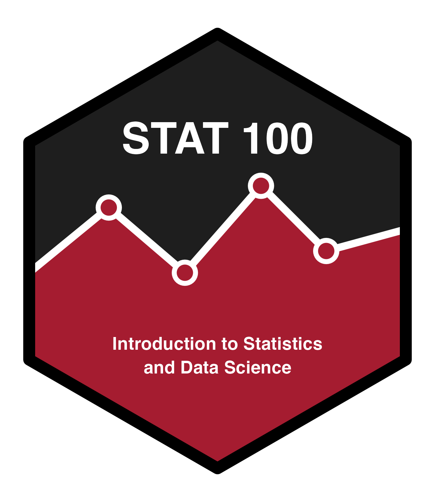

::: r-fit-text
Hello 
:::

# Title 1

## Quarto

Hi Quarto!
Quarto enables you to weave together content and executable code into a finished presentation. To learn more about Quarto presentations see <https://quarto.org/docs/presentations/>.

## Bullets

When you click the **Render** button a document will be generated that includes:

-   Content authored with markdown
-   Output from executable code

## Code

When you click the **Render** button a presentation will be generated that includes both content and the output of embedded code. You can embed code like this:

```{r}
#| echo: true
1 + 1
```

## More code

```{r}
#| echo: true
library(magrittr)
lm(mpg ~ am, data = mtcars) %>% 
  broom::tidy()
```

## Highlight Specific Lines of Code

```{r}
#| echo: true
#| code-line-numbers: "|1|3"
a <- 1
b <- 1
a + b
```

## Code Annotation

```{r}
#| echo: true
library(beepr)
beep() # <1>
# a comment # <2>
```

1. Here we can explain what that line of code is doing.
2. Here we can explain that the second line is just a comment.

## Math

We can add a centered equation

$$x+7\beta$$

or left aligned:

$x+7 +\mu$


## Figure

We can add an a figure with a caption and an alternate text

```{r}
#| echo: false
#| out-width: 20%
#| fig-align: center
#| fig-cap: STAT 100 logo
#| fig-alt: A hex logo with a heavy black border, split horizontally by a white zigzag line chart featuring four hollow crimson data points. The top half is solid black with the bold white text "STAT 100", and the bottom half is solid crimson with the white text "Introduction to Statistics and Data Science". 

```

## Incremental Text

To display text incrementally, three dots with spaces can be used on a new line . . .

. . .

By default, qmd displays bullet points and enumerated text (i.e., lists) incrementally, this can ben changed in the YAML (top) section of the document by setting `incremental: false`.

. . .

Or it can be turned off for a specific part of the document

::: nonincremental
-   1st Item
-   2nd Item
:::

## Divide slide into columns

::: columns
::: {.column width="40%"}
Left column
:::

::: {.column width="60%"}
Right column
:::
:::

## Code and Output in Two Columns

```{r}
#| output-location: column
summary(mtcars)
```


## Code and Output in Deparate Slides

```{r}
#| output-location: slide
summary(mtcars)
```


## Tabsets as Shown on Quarto Website

::: {.panel-tabset}

### Tab A

Content for `Tab A`

### Tab B

Content for `Tab B`

:::

## Standard Quarto callouts

::: callout-note

## Note with custom title
These are main types of callouts: `note`, `warning`, `important`, `tip`.

:::

::: callout-warning
This is a warning
:::

::: {.callout-important collapse="true"}
## This is important!

This is an important information.
:::

::: callout-tip
## Tip

Breathe!
:::

## Customized callouts

::: {.callout-note icon=false}
## Exercise

Exercise text goes here

:::

::: {.callout-warning icon=false}
## Discussion question

Question to discuss
:::

::: {.callout-tip icon=false}
## Example

Here is an example
with some math symbols $\alpha, \beta$
:::